# CANOPY IMPLEMENTATION BLUEPRINT

**Version:** 1.1
**Status:** Implementation-ready. Planning phase complete. No application code written.
**Primary source of truth:** `CANOPY / SDE — MILESTONE 1 OF 5` (concept analysis, platform definition, scope control).
**Audience:** AI coding agents (Codex, Claude Code, Gemini CLI) and human reviewers.
**Build window:** 24 hours.

### Changelog

**v1.1** — incorporates Sections 1–3 of a revision prompt (`CANOPY_BLUEPRINT_REVISION_PROMPT.md`) that reached this document only partially; Sections 4 onward were never received, so this revision cannot claim to reflect a document it was never shown in full. Three changes made from confirmed material:
1. §2.2 core loop extended to `… BRANCH → FORK → MERGE → COMPARE → UNDERSTAND → REMEMBER → CONTINUE`, matching the finalized loop, which already matches what §12–14 build.
2. §2.3 added: a Git mental-model mapping table, annotated against the M1 finding that the analogy holds for some Git properties and not others, so an agent reads it as vocabulary rather than as literal semantics to implement.
3. §3.6 added and §4.1/§4.3 updated: Memory **storage** is confirmed as Core-owned (survives an AI outage, like a version does); Memory **retrieval and extraction** remain Intelligence-owned. This resolves a placement question the revision prompt's diagram left ambiguous by putting Creative Memory wholly under Creative Intelligence.

If further sections of the revision prompt still exist and are supplied, they will be audited against v1.1, not against v1.0.

---

## 1. Executive Summary

Canopy is a platform for versioning, understanding, and preserving the evolution of human + AI creative work across tools and AI systems. It is not a web application with an API bolted on. It is a shared **Canopy Core** with three surfaces over it — Web, Android, MCP — and an integration layer for external creative systems.

The defensible product claim, carried forward unchanged from M1:

> The **action** — not the file — is the primary object, and actions taken by a human and actions taken by a model are recorded in the same ledger with the same structure.

Everything in this blueprint follows from that. Three consequences drive the architecture:

1. **Typed, parameterised actions make hard things cheap.** Because a human edit is stored as `{type: "adjust", params: {brightness: +12}}` rather than as an opaque result image, Canopy can compute a diff without a vision model, replay operations onto a different base, and therefore perform a **real creative merge** rather than a fake one. This is the single highest-leverage decision in the document.
2. **Intelligence is a consumer of Core, never a peer.** Semantic diff, Copilot, Memory and embeddings read history and produce derived artefacts. They never write to the version graph. Every AI feature can fail without corrupting anything, which is what makes the fallback demo real rather than theatrical.
3. **One Write Path.** Web, Android, MCP, future plugins, CLI, test fixtures and demo seeds all execute the same Core operations, with the same validation and the same invariant checks. No surface has a private door.

**What gets built in 24 hours (P0):** Core domain + Postgres + object storage, the API, Web workspace with a minimal editor, commit/version/lineage, Gemini image generation and editing, branch (continue-from), fork, deterministic merge, semantic diff (declared + path + observed), user-authored Creative Memory, grounded Copilot with citations.

**What gets built if the schedule holds (P1/P2):** read-only MCP server, AI-assisted merge, AI-extracted memory proposals, a three-screen read-only Android client.

**What is architecture-only (FUTURE):** browser extension, Figma/Photoshop/Illustrator plugins, CLI, public developer API, video/audio/document media, collaboration and roles, C2PA signing.

**Honest statement on scope.** Web + Android + MCP + fork + merge + memory + diff + Copilot cannot all be *fully* built in 24 hours by any team. This blueprint therefore separates the **architecture**, which covers all of it and is designed so nothing needs re-architecting later, from the **build plan**, which is ruthless. Section 40 classifies every feature P0/P1/P2/FUTURE, and Section 39 gives an hour-by-hour schedule that does not pretend otherwise.

---

## 2. Product Definition

### 2.1 What Canopy is

A system of record for creative iteration. A creative project accumulates versions; each version is an immutable snapshot produced by exactly one action, performed by exactly one actor, which is either a human or a model. The resulting graph is queryable, comparable, explainable, and forkable.

### 2.2 The core loop

```
CREATE → EDIT → CAPTURE → VERSION → BRANCH → FORK → MERGE → COMPARE → UNDERSTAND → REMEMBER → CONTINUE
```

CAPTURE remains the value-creating step regardless of how many stages surround it. If capture fidelity is poor, the lineage is fiction and every downstream feature inherits the fiction. Capture fidelity is the platform's primary quality metric and the first thing the test suite covers.

The three stages added in this revision were not bolted on — each already has a home elsewhere in this blueprint, and the loop was simply incomplete without them:

| Stage | Where it's built | What it is not |
|---|---|---|
| FORK | §12 | Not the same operation as BRANCH. BRANCH (`continue from`) stays inside one project; FORK starts a new one. |
| MERGE | §13 | Not a raster blend. An operation-set composition, replayed onto a common ancestor. |
| REMEMBER | §14 | Not a restatement of lineage. A separate claim about what a version *meant*, per invariant I-10. |

### 2.3 Git mental model mapping

Git is the mental model the product borrows its legibility from, but a mapping table is vocabulary, not a spec — where a Git concept maps cleanly, use the Git word to explain the Canopy word; where it doesn't (§01 of the M1 analysis found several: no three-way merge for rasters, no offline clone, branch is computed rather than a stored pointer), the right-hand column is what actually gets built, not the left-hand metaphor.

| Git concept | Canopy concept | Built as (this blueprint) |
|---|---|---|
| Repository | Creative Project | `projects` table (§25.2) |
| File | Creative Asset | `assets` table, content-addressed (§25.3) |
| Commit | Creative Version | `versions` table, immutable (§25.5) |
| Commit message | Creative Action + declared delta | `actions.params` + `actions.declared_delta` (§10.2) — **not** the same as `version_annotations.note`, which is a free-text label a human adds afterward |
| Branch (pointer) | Branch (computed shape) | Not stored. A version with >1 child, walked at read time (§11.3) |
| Fork | Creative Fork | Cross-project only; copies nothing (§12) |
| Three-way merge | Creative Merge | Operation-set composition over an LCA — a different algorithm, not an analogue (§13) |
| Diff | Semantic Creative Diff | Three-source: declared, path, observed (§15) |
| History / log | Creative Lineage | The DAG (§11) |
| Commit metadata (author, hash) | Creative Provenance | `provenance` table, including what a provider didn't report (§16) |
| GitHub Copilot | Canopy Copilot | Query-planning first, retrieval second (§20) |
| GitHub API | Canopy API | `/v1`, one write path (§27) |
| GitHub Apps / integrations | Canopy Extensions | Capture contract, fidelity-tiered, FUTURE (§24) |
| MCP / API access | AI-agent access to Canopy | Read-only tool set over the same API (§21) |

### 2.4 What Canopy is not

Not Photoshop, not Canva, not a DAM, not cloud storage, not an image generator, not a generic chatbot, not a Git clone, not a social network, not a marketplace. It is **creative evolution infrastructure**.

### 2.5 Terminology (normative — agents must use these exact words)

| Term | Meaning |
|---|---|
| **Project** | A container for one creative effort. Owned by exactly one user in MVP. |
| **Asset** | An immutable, content-addressed binary (image in MVP). Deduplicated by SHA-256. |
| **Working State** | Mutable, session-scoped, uncommitted edit state. Never appears in lineage. |
| **Commit** | The explicit gesture that converts Working State into a Version. |
| **Version** | An immutable node in the project's history DAG. Never mutated, never deleted. |
| **Action** | The typed, parameterised operation that produced a Version. |
| **Actor** | Who performed the Action. `actor_type` is `human` or `model`. |
| **Lineage** | The DAG of versions within a project. |
| **Branch** | A divergent path in the DAG. Computed from graph shape, not stored as an entity. |
| **Continue from** | Creating a new version parented to an earlier version. The branching primitive. |
| **Fork** | Creating a **new project** whose origin is a version in another project. Cross-project. |
| **Merge** | Combining two compatible creative directions into one new version with ≥2 parents. |
| **Provenance** | The recorded origin of a version: actor, model, prompt, parameters, tool, and explicitly what is missing. |
| **Semantic Diff** | A structured, three-source explanation of the difference between two versions. |
| **Creative Memory** | Durable statements of what was learned, decided, preferred, rejected, intended or constrained. |
| **Copilot** | Grounded question-answering over lineage + memory, with citations. |
| **Capture Fidelity** | How complete a version's provenance is: `full`, `partial`, or `output_only`. |

Forbidden words in code and UI: "rollback" (use *continue from*), "commit history" (use *lineage*), "revert" (use *continue from*), "prompt history" (use *provenance*).

---

## 3. M1 Decisions and Overrides

M1 remains the architectural source of truth. Four of its scope decisions are explicitly overridden by the master prompt. Each override is recorded in the required format.

### 3.1 Override 1 — Fork

| | |
|---|---|
| **M1 decision** | R-04: Cut Fork entirely. Meaningless in a single-user MVP; "fork an earlier version" renamed to "continue from". |
| **Proposed change** | Fork is retained as a **distinct, cross-project** operation. "Continue from" remains the *intra*-project branching primitive. The two are not the same operation and no longer compete for the same word. |
| **Reason** | M1 cut Fork because it was indistinguishable from continue-from *inside one project*. Given a real definition — a fork creates a new project rooted at a version of another project — it is distinct, useful (exploring a client's alternate brief without polluting the original), and demonstrable single-user. |
| **Consequence** | Adds `project_forks` table, a cross-project origin reference on the root version, and a cross-project authorization check. Requires assets to be shareable without duplication, which forces the **global content-addressed asset + `project_assets` grant** model (Section 25). That model is better anyway: it gives deduplication across all projects for free. Fork costs roughly 1.5 hours; the asset model change costs zero because it is adopted from the start. |

### 3.2 Override 2 — Merge

| | |
|---|---|
| **M1 decision** | R-05: Cut Merge. No merge algebra exists for raster images; what looks like merge is compositing. |
| **Proposed change** | Merge is retained, defined as **operation-set merge**, not pixel merge. Because actions are typed and parameterised, Canopy computes the lowest common ancestor of two versions, collects the declared operation sets on each side, detects conflicts at the operation level, composes a merged operation list, and replays it onto the LCA asset. Where a side contains a non-replayable step (an AI generation), merge falls back to AI-assisted composition or manual resolution. |
| **Reason** | M1's reasoning was correct *for pixels* and incorrect *for operations*. The typed-action model M1 itself mandates makes a deterministic merge implementable. This is the strongest technical story in the product and it is not fake. |
| **Consequence** | Requires ordered multi-parent edges (M1 already mandated an ordered parent set in R-05, so no schema change), an LCA algorithm over the DAG, a conflict taxonomy, and merge UI. Costs roughly 3 hours for deterministic merge + manual resolution; AI-assisted merge is P2. Merge produces a new immutable version; source versions are never mutated. |

### 3.3 Override 3 — Creative Memory

| | |
|---|---|
| **M1 decision** | R-08: Cut the memory subsystem. The lineage *is* the memory; keep only a summary field plus embedding on each version. |
| **Proposed change** | Creative Memory is retained as a dedicated subsystem with its own entity, lifecycle and retrieval path. The version summary + embedding from M1 is **also** retained, for a different purpose. |
| **Reason** | M1 assessed memory as duplicating lineage because §16 of the original brief listed memory contents that were all already in the version records. That assessment holds for *facts*. It does not hold for *interpretations*. "V7 was rejected because the client said the blue read as corporate" is not derivable from any version row. Lineage answers **what happened**; Memory answers **what it meant**. Those are different questions and Copilot needs both. |
| **Consequence** | Adds `memories` table, memory CRUD, memory retrieval in the Copilot pipeline, and a confirmation flow for AI-extracted memories. The strict rule that prevents M1's feared duplication: **Memory never restates a fact that lineage already holds.** A memory that could be answered by a lineage query is invalid input and the UI discourages it. Memory rows reference source versions rather than copying their content. Costs roughly 2 hours for user-authored memory (P0); AI extraction is P2. |

### 3.4 Override 4 — Android build

| | |
|---|---|
| **M1 decision** | R-06: Document Android architecture in full; do not build it in the hackathon window. |
| **Proposed change** | Partially overridden. Full architecture is still documented (Section 23). A **three-screen read-only Android client** is added as P2 — built only if Phases 0–9 complete on schedule. |
| **Reason** | The master prompt requires Android as a first-class surface and forbids a disconnected demo. A read-only client that consumes the same API proves the platform claim without a second editor implementation. |
| **Consequence** | If built, it proves "same Core, different surface" on stage. If not built, the demo loses nothing structural, and the architecture document still forced the API to be client-agnostic, which was the real point. Hard rule: **Android is never allowed to delay P0 or P1 work.** |

### 3.5 Retained M1 decisions (not overridden — agents must not revisit)

| M1 ref | Decision | Status |
|---|---|---|
| R-01 | Three-source semantic diff: declared delta + path summary + observed delta, with discrepancy exposure | **Retained, expanded in §15** |
| R-02 | Copilot is query-planning first, retrieval second; closed set of history operations | **Retained, expanded in §20** |
| R-03 | Rollback is not a distinct operation; it is continue-from | **Retained. Cut stands.** |
| R-05 (parent set) | Ordered parent set from day one; graph must remain acyclic | **Retained, now load-bearing for merge** |
| R-09 | One provider implemented behind a documented contract; missing metadata is a recorded outcome, not an error | **Retained, expanded in §17** |
| R-10 | Adjustments non-destructive until commit; cut masks, brushes, layers, blend modes | **Retained** |
| R-11 | Explicit commit gesture; working state never auto-promotes to a version | **Retained. Critical.** |
| R-12 | Copilot never writes; it proposes, the client confirms, the write goes through the same API | **Retained; proposals are P2** |
| R-13 | Canopy-internal provenance only; no C2PA compliance claims | **Retained** |
| R-14 | Capture fidelity tiers: `full` / `partial` / `output_only` | **Retained; now a column** |
| R-15 | Single-owner projects; ownership enforced at the data-access layer, not the UI | **Retained** |
| R-16 | Media-type field + asset indirection + extensible action taxonomy; no timeline entities | **Retained** |

### 3.6 Resolution — Memory storage sits in Core, not wholly in Intelligence

A later architecture diagram grouped Creative Memory together with Semantic Diff and Copilot under "Creative Intelligence," alongside placing AI/RAG inside Core. Taken literally, that would make a user-authored memory a derived artefact rather than a durable record — which contradicts the reason Override 3 (§3.3) exists at all.

**Resolution:** memory is split the same way every other Canopy concern is split (§4.3's own pattern, applied consistently):

| | Owns | Layer |
|---|---|---|
| **Memory storage** | The `memories` table: create, edit-as-supersession, archive, status transitions (I-10) | **Core** — authoritative, survives any AI outage |
| **Memory retrieval + extraction** | Hybrid search (§14.6), AI-proposed memories (§14.5, P2) | **Intelligence** — derived, may degrade or be unavailable without losing the underlying record |

This is why a memory a user typed in must still be readable, editable and citable with every AI provider down — the same property versions have (§4.1's rule that no read path depends on a model call succeeding). The diagram and table in §4.1/§4.3 are updated accordingly.

---

## 4. Platform Architecture

### 4.1 Layer model

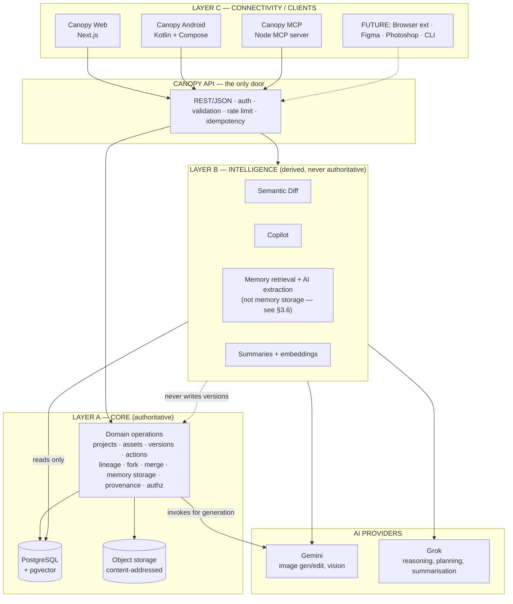

### 4.2 The One Write Path rule

Every mutation of creative history enters through the same Core operation, regardless of origin.

```
Surface (Web | Android | MCP | CLI | plugin | test fixture | demo seed)
  ↓  transport-specific adapter
API route handler
  ↓  authenticate → resolve actor → authorize project access
Command object (validated against shared Zod schema)
  ↓
Core operation  (packages/domain — pure, no I/O)
  ↓  invariant checks (I-1 … I-9, §7.4)
Repository / persistence port
  ↓
PostgreSQL transaction + object storage write
  ↓
Immutable Version + Action + Provenance rows
```

**Mechanical test an agent can apply:** if a capability can be performed from the Web client but cannot be expressed as a Core operation invoked with a command object, the architecture has failed and the Web client has become the product. Reject the PR.

**Forbidden:** any client constructing a version ID, computing a content hash the server does not re-verify, writing to Postgres outside the repository layer, or calling an AI provider directly from a client.

### 4.3 Layer responsibilities and forbidden dependencies

| Layer | Owns | May depend on | **Forbidden** |
|---|---|---|---|
| **Core** (`packages/domain`) | Entities, invariants, version creation, lineage algebra, LCA, merge composition, fork rules, **memory storage and lifecycle (§3.6)**, authorization decisions | `packages/schemas` only. Pure TypeScript, no I/O. | HTTP, React, Postgres driver, any provider SDK, `process.env` |
| **Persistence** (`services/api/src/repositories`) | SQL, transactions, object storage calls | `packages/domain` types, Drizzle, storage client | Business rules, AI calls |
| **API** (`services/api`) | Routes, auth, validation, errors, rate limits, idempotency, orchestration | domain, repositories, intelligence, providers | Domain logic inline in a route handler |
| **Intelligence** (`services/api/src/intelligence`) | Diff, Copilot, planning, **memory retrieval and AI-extraction proposals only — never memory storage**, summaries, embeddings | Read-only repository ports, providers | Writing to `versions`, `actions`, `provenance`, `assets`, **or `memories` directly** — memory writes go through Core's own operation (`createMemory`, `updateMemoryStatus`, §6.3) even when Intelligence originates the proposal |
| **Providers** (`services/api/src/providers`) | Gemini and Grok adapters | Provider SDKs, `packages/schemas` | Leaking provider types past the adapter boundary |
| **Clients** | Presentation, working state, local cache, offline queue | `packages/api-client`, `packages/schemas` | Authoritative state; enforcing a rule not also enforced server-side |
| **MCP** (`services/mcp`) | Protocol translation, tool schemas | `packages/api-client` over HTTP | Direct DB access; bypassing API auth |

---

## 5. Platform Surfaces

### 5.1 Canopy Web — the primary workspace

Full read and write. Owns the editor, the lineage canvas, compare/diff, merge resolution, memory authoring, Copilot. Desktop-first, responsive down to tablet. Detailed in §22.

### 5.2 Canopy Android — first-class mobile client

Consumes the identical API contract via a generated Kotlin client. MVP slice is read-and-capture: browse projects, browse lineage, inspect a version with provenance, ask Copilot. Future: camera capture → commit, lightweight adjustments, approve/reject. Detailed in §23.

### 5.3 Canopy MCP — machine interface

An MCP server exposing Canopy's creative primitives as tools to AI assistants. It is an interface into Canopy, not a separate product, and it **never bypasses Core validation** — it calls the same HTTP API with a scoped token. Detailed in §21.

### 5.4 Future surfaces — extension points only

| Surface | Extension point that must exist now | Built now |
|---|---|---|
| Browser extension | `POST /v1/projects/:id/captures` with `capture_fidelity: output_only` | No |
| Figma / Photoshop / Illustrator plugins | Same capture endpoint + a `source_tool` provenance field | No |
| CLI | Personal access tokens with scopes (`api_tokens` table exists in MVP for MCP) | Token model yes, CLI no |
| Public developer API | API is versioned at `/v1` from day one; error model is stable | Versioning yes, public access no |
| Additional AI providers | `AIProvider` interface + capability declaration (§17.2) | Interface yes, third provider no |
| Video / audio / document media | `assets.media_type` + `actions.type` open taxonomy + asset indirection on versions | Fields yes, handling no |

---

## 6. Core Architecture

### 6.1 Shape

A **modular monolith**. One deployable API service containing domain, persistence, intelligence and provider adapters as internal modules with enforced dependency direction. Plus one small separate MCP service, because MCP has a different transport, a different auth model, and a different failure blast radius.

Rejected: microservices (no scaling problem exists; adds hours of infrastructure for zero demo value), serverless-per-function (cold starts hurt an interactive editor; image processing needs memory and time).

### 6.2 Module boundaries inside the API service

```
services/api/src/
  routes/          HTTP only. Parse → validate → call operation → serialise.
  operations/      Application services. Orchestrate domain + repos + providers + intelligence.
  repositories/    SQL + storage. The only place Drizzle appears.
  intelligence/    diff/ copilot/ memory/ embeddings/ — read-only against repos.
  providers/       gemini/ grok/ — adapters implementing AIProvider.
  lib/             auth, errors, logging, idempotency, rate limit, config.
```

Dependency direction is strictly downward: `routes → operations → {domain, repositories, intelligence, providers}`. `domain` depends on nothing but `schemas`. Enforced by an ESLint import-boundary rule; a violation fails CI.

### 6.3 Core operation catalogue

Every write in the system is one of these. Agents must not add an operation without updating this table.

| Operation | Inputs | Produces | Invariants checked |
|---|---|---|---|
| `createProject` | name, goal | project | — |
| `importAsset` | project, bytes, mime | asset, root version | I-1, I-3, I-4, I-5 |
| `commitWorkingState` | project, base version, op list, label | version, action, asset | I-1..I-6 |
| `generateVersion` | project, base version (optional), prompt, model | version, action, provenance, asset | I-1..I-7 |
| `continueFrom` | version | working state seeded from that version | I-2 |
| `forkProject` | source version, new project name | project, fork record, root version | I-1..I-5, I-8 |
| `mergeVersions` | version A, version B, strategy, resolutions | version (≥2 parents), action, asset | I-1..I-6, I-9 |
| `createMemory` | project, type, statement, source refs | memory | I-10 |
| `updateMemoryStatus` | memory, status | memory (supersession chain) | I-10 |
| `createCapture` | project, bytes, declared metadata, fidelity | asset, version | I-1..I-5, fidelity honesty |

Read operations (no invariants, authorization only): `getProject`, `listProjects`, `getVersion`, `getLineage`, `getPath`, `getSubtree`, `getDiff`, `searchVersions`, `searchMemory`, `listProvenance`.

---

## 7. Domain Model

### 7.1 Entity relationship overview

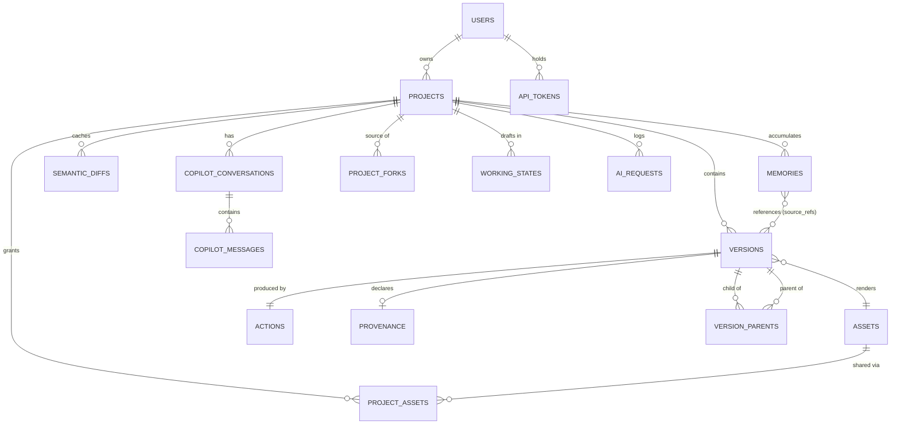

### 7.2 Entity definitions

| Entity | Mutability | Purpose |
|---|---|---|
| `User` | Mutable | Identity and ownership root. |
| `Project` | Mutable metadata, immutable identity | Container. Holds name, creative goal, owner. |
| `Asset` | **Immutable** | Content-addressed binary. Globally deduplicated by SHA-256. No `project_id` — access is granted via `project_assets`. |
| `ProjectAsset` | Append-only | Grant: this project may read this asset. Makes fork free and dedup global. |
| `Version` | **Immutable** | A node in the lineage DAG. |
| `VersionParent` | **Immutable** | Ordered edge. `parent_index` 0 is the primary parent. |
| `Action` | **Immutable** | The typed operation that produced the version. 1:1 with version. |
| `Provenance` | **Immutable** | Origin record. Present for every version; richer for model actors. |
| `WorkingState` | **Mutable** | Uncommitted draft. Deletable. Never in lineage. |
| `Memory` | Mutable with supersession | Interpretation layer. Soft-archived, never hard-deleted. |
| `SemanticDiff` | Cache | Derived. Invalidatable at any time. |
| `CopilotConversation` / `Message` | Append-only | Q&A log with citations. |
| `ProjectFork` | **Immutable** | Cross-project origin link. |
| `AiRequest` | Append-only | Observability + cost record for every provider call. |
| `ApiToken` | Mutable | Scoped credential for MCP / CLI. |

### 7.3 Actor model

```
Actor = { type: "human" | "model", ... }

human  → actor_user_id  (FK users.id)
model  → actor_provider (e.g. "gemini")
         actor_model    (e.g. "gemini-3.1-flash-image")
         actor_on_behalf_of_user_id  (the human who requested it)
```

Every model action records the human who initiated it. There are no autonomous actors in MVP. `actor_on_behalf_of_user_id` is NOT NULL for every `model` version — this is how "the AI did it, but a person asked" stays legible in provenance and how MCP-initiated writes stay attributable.

### 7.4 Invariants (normative — the test suite is written against these)

| ID | Invariant | Enforced where |
|---|---|---|
| **I-1** | A version, once created, is never updated or deleted. Corrections create new versions. | DB: no UPDATE/DELETE grants on `versions` for the app role; revoke at migration time. Domain: no update operation exists. |
| **I-2** | Every non-root version has ≥1 parent; every parent is in the same project (except a fork root, see I-8). | Domain + FK + check |
| **I-3** | The lineage graph is acyclic. | Domain: ancestor check before insert, inside the transaction |
| **I-4** | Every version references exactly one committed asset. | FK NOT NULL |
| **I-5** | Every version has an action, an actor, an actor_type, a project, a timestamp and a provenance row. | FK NOT NULL + domain |
| **I-6** | Every model-actor version records provider, model, prompt-as-submitted, and an explicit `missing_fields` list naming what the provider did not return. | Domain validation on `generateVersion` |
| **I-7** | No derived artefact (diff, summary, embedding, Copilot answer, memory) is ever treated as history. | Architecture: intelligence has no write port to version tables |
| **I-8** | A fork root version declares `origin_version_id` pointing at a version in the source project, and no `version_parents` edges. Upstream history is referenced, never copied. | Domain + `project_forks` |
| **I-9** | A merge version has ≥2 parents, all in the same project, and records the merge strategy and resolved conflict set. | Domain |
| **I-10** | A memory references source versions by ID; it never duplicates a fact that a lineage query would return. | Domain validation + review checklist |
| **I-11** | Every read and write verifies project access at the repository layer, not the route layer. | Repository base class takes an `AuthContext` and refuses to build a query without it |

---

## 8. Versioning Model

### 8.1 Version creation paths

There are exactly five ways a version comes into existence. Agents must not add a sixth.

| Path | Trigger | actor_type | capture_fidelity |
|---|---|---|---|
| **Import** | User uploads a file | human | `full` |
| **Commit** | User commits working state | human | `full` |
| **Generate** | User requests AI generation or AI edit | model | `full` |
| **Merge** | User merges two versions | human (or model for AI-assisted) | `full` |
| **Capture** (FUTURE) | External tool submits an asset | human or model | `partial` or `output_only` |

### 8.2 Version record shape (conceptual)

```
Version {
  id: uuid
  project_id: uuid
  asset_id: uuid                 // the rendered result
  action_id: uuid                // 1:1
  actor_type: 'human' | 'model'
  actor_user_id: uuid?           // required when human
  actor_provider: text?          // required when model
  actor_model: text?             // required when model
  actor_on_behalf_of_user_id: uuid?   // required when model
  origin_version_id: uuid?       // fork roots only, cross-project
  label: text?                   // user-supplied short name
  note: text?                    // commit message
  summary: text?                 // AI-generated one-liner (derived, nullable)
  summary_embedding: vector(768)? // derived, nullable
  capture_fidelity: 'full'|'partial'|'output_only'
  sequence: integer              // per-project monotonic, for display as "V7"
  created_at: timestamptz
}
```

`sequence` is a per-project counter used only for human-readable labels (`V1`, `V2`). It is **not** an ordering of the DAG and must never be used for traversal. Allocate it inside the same transaction with a row-level lock on the project.

### 8.3 Immutability enforcement

Three layers, because one is not enough under agent-assisted development:

1. **Database role.** The application role is granted `SELECT, INSERT` on `versions`, `version_parents`, `actions`, `provenance`, `assets` — not `UPDATE` or `DELETE`. Migration sets this explicitly.
2. **Repository layer.** No update or delete method exists on those repositories. There is nothing to call.
3. **Test.** `domain/versions.immutability.test` attempts an update through every reachable path and asserts failure.

Only `label` and `note` are user-correctable, and correcting them creates no new version — they are stored in a separate `version_annotations` table that *is* mutable, so the version row itself stays untouched. This keeps I-1 absolute while allowing a typo fix.

---

## 9. Working State

### 9.1 The rule M1 established and this blueprint enforces

> Versions are created **only** by an explicit commit, except for AI generation (where the generation request is the deliberate act) and external capture (where the submission is). Working state is never auto-promoted.

Without this, agents will implement autosave and the lineage graph will fill with four hundred meaningless nodes, destroying both the product and the demo.

### 9.2 Model

```
WorkingState {
  id: uuid
  project_id: uuid
  user_id: uuid
  base_version_id: uuid          // what we are editing from
  ops: EditOp[]                  // ordered, typed, parameterised
  preview_asset_id: uuid?        // optional baked preview for cross-device resume
  updated_at: timestamptz
}
```

At most one active working state per (project, user, base_version). Starting a new one from a different base replaces it after a confirmation prompt.

### 9.3 Lifecycle

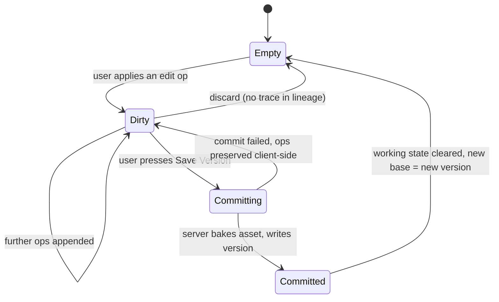

### 9.4 Client vs server responsibility

| Concern | Where |
|---|---|
| Live preview of adjustments | Client, via CSS filters on a canvas layer. Instant, zero server cost. |
| Op list accumulation and coalescing | Client. Consecutive ops of the same type on the same target collapse into one (three brightness drags = one `adjust` op). |
| Draft persistence across devices | Server, debounced at 2s, P1. Not required for the demo. |
| **Baking pixels** | **Server, at commit only.** The client sends the op list, not the rendered image. |

**Why the server bakes:** if the client sends pixels, the op list and the asset can disagree, and declared-delta diff (§15) and merge replay (§13) both become untrustworthy. The server rendering the op list onto the base asset guarantees that `asset == replay(base_asset, ops)`, which is the property merge depends on. Server-side rendering uses `sharp`.

**Exception:** text overlay rendering must match between client preview and server bake. Mitigation: the client sends font family, size, weight, colour, position and rotation as parameters; the server renders with the same bundled font files (ship 2 fonts only — one sans, one serif). Any font not in the bundle is rejected at validation. This is a deliberate capability restriction to preserve the invariant.

---

## 10. Actions and Actors

### 10.1 Action taxonomy

Open taxonomy (a string `type`, not a Postgres enum) so future media can extend it without a migration. MVP set:

| `type` | Params (validated by a per-type Zod schema) | Replayable | Declared delta produced |
|---|---|---|---|
| `import` | `{ filename, source }` | n/a | "Imported as root" |
| `adjust` | `{ brightness?, contrast?, saturation?, exposure?, temperature? }` — each −100..100 | Yes | "Brightness +12, contrast −5" |
| `crop` | `{ x, y, w, h }` in source pixels | Yes | "Cropped to 1200×800, removed 18% of frame" |
| `rotate` | `{ degrees: 90 \| 180 \| 270 }` | Yes | "Rotated 90° clockwise" |
| `flip` | `{ axis: 'horizontal' \| 'vertical' }` | Yes | "Flipped horizontally" |
| `resize` | `{ w, h, fit }` | Yes | "Resized to 1080×1080" |
| `text_overlay` | `{ content, font, size, weight, color, x, y, rotation, align }` | Yes | "Added text: 'SUMMER'" |
| `ai_generate` | `{ prompt, model, aspect_ratio, seed? }` | **No** | "AI generated from prompt: …" |
| `ai_edit` | `{ instruction, model, reference_version_ids[] }` | **No** | "AI edit: 'remove the background'" |
| `merge` | `{ strategy, lca_version_id, resolutions[] }` | **No** | "Merged V4 and V7 (operation merge, 2 conflicts resolved)" |
| `fork_origin` | `{ source_project_id, source_version_id }` | n/a | "Forked from Project X · V5" |
| `capture` (FUTURE) | `{ source_tool, external_id, declared_ops? }` | No | tool-dependent |

**Replayable** is the property merge depends on. An op set containing only replayable ops can be deterministically composed onto a different base. Any side containing a non-replayable op forces merge strategy `ai_composite` or `manual`.

### 10.2 Action record shape

```
Action {
  id: uuid
  version_id: uuid
  type: text
  params: jsonb                  // validated against the per-type schema
  declared_delta: jsonb          // { summary: string, facets: {composition?, color?, ...} }
  replayable: boolean            // denormalised from type, for fast merge queries
  surface: 'web'|'android'|'mcp'|'api'|'seed'   // which surface originated it
  created_at: timestamptz
}
```

`declared_delta` is computed **at write time** by a pure function in `packages/domain` from `params`. It requires no AI, costs nothing, and is the deterministic backbone of semantic diff. A commit with three ops produces three facet entries in one declared delta.

`surface` exists so the demo can show "this version came in through MCP" and so abuse is traceable.

---

## 11. Lineage

### 11.1 Representation

Adjacency via `version_parents(version_id, parent_version_id, parent_index, role)`.

| `role` | Meaning |
|---|---|
| `primary` | The version this one was edited from. `parent_index = 0`. Exactly one per non-root version. |
| `merge_source` | The second and subsequent inputs to a merge. `parent_index ≥ 1`. |

A plain edit has one edge. A merge has two or more. A root (import or fork origin) has zero.

**Why an edge table and not a `parent_id` column:** M1's R-05 established that single-parent would have to be migrated later for compositing and video. Merge makes that "later" arrive immediately. The edge table costs one join and removes an entire class of future migration.

### 11.2 DAG validation

Performed inside the write transaction, before insert:

```
ensureAcyclic(newVersionId, proposedParents):
  # newVersionId is not yet persisted, so a cycle can only occur
  # if a proposed parent is a descendant of another proposed parent,
  # or (for merge) if the two sides are the same version.
  assert proposedParents are distinct
  assert all proposedParents belong to the same project
  for each parent p:
      assert p exists and is visible to the auth context
  # descendant check for merge only:
  for each pair (a, b) in proposedParents:
      assert not isAncestor(a, b) and not isAncestor(b, a)
```

`isAncestor` uses a recursive CTE with a depth cap of 500 and a visited set. Because versions are immutable and edges are only ever inserted for a brand-new node, a true cycle is structurally impossible; these checks catch the degenerate cases (merging a version with its own ancestor, merging a version with itself) and are cheap.

### 11.3 Traversal operations (the closed set Copilot is allowed to call)

| Operation | Returns | Implementation |
|---|---|---|
| `getLineage(projectId)` | All versions + edges for graph render | Two indexed selects, no recursion |
| `getPath(fromId, toId)` | Ordered version list along the connecting path, or `null` | Recursive CTE upward from `toId`, stopping at `fromId`; if not found, walk to LCA and return the two half-paths |
| `getSubtree(versionId)` | All descendants | Recursive CTE downward |
| `getChildren(versionId)` | Direct children | Indexed select |
| `getAncestors(versionId)` | Path to root | Recursive CTE upward via `role='primary'` |
| `findLCA(aId, bId)` | Lowest common ancestor | Ancestor set of A ∩ ancestor set of B, take max depth |
| `getBranchTips(projectId)` | Versions with no children | Anti-join |

**Branches are computed, never stored** (M1 R-04, retained). A branch point is a version with >1 child. A branch is the path from a branch point to a tip. An optional human label lives in `version_annotations.branch_label` on the first version of the divergent path, which is what answers Copilot's "which branch explored the cinematic style?" without a Branch entity.

### 11.4 Graph scale

A hackathon project holds tens of versions; a real one might hold thousands. `getLineage` returns the whole graph up to 2,000 versions, then switches to a windowed view around the selected version (ancestors + descendants to depth 3). Implement the cap on day one as a constant; implement the windowed view as FUTURE.

---

## 12. Fork

### 12.1 Definition

> **Fork** creates a **new project** whose origin is a version belonging to another project.

Fork is cross-project. Continue-from is intra-project. They are different operations with different tables, different endpoints and different UI. Agents must not conflate them.

| | Continue from | Fork |
|---|---|---|
| Scope | Same project | New project |
| Creates | A version with a parent edge | A project + a root version with `origin_version_id` |
| Lineage effect | The existing DAG branches | A new, separate DAG begins |
| Upstream history | Same graph | Referenced read-only, never copied |
| Use case | "Try a warmer palette on V6" | "The client wants a totally different campaign from this frame" |

### 12.2 What fork copies — nothing

| Thing | Copied? | Mechanism |
|---|---|---|
| Version rows | **No** | The fork root declares `origin_version_id`; upstream is reachable through `project_forks` |
| Asset bytes | **No** | Assets are globally content-addressed; a `project_assets` grant row is inserted for the origin asset |
| Actions / provenance | **No** | Reachable upstream |
| Memories | **No** by default | P2: optional "carry over active constraints and goals" checkbox, which *copies* selected memory rows with `derived_from_memory_id` set |

A fork is therefore three inserts and one grant. It is O(1) regardless of upstream history size.

### 12.3 Authorization

Forking requires **read** access to the source version (MVP: the user owns the source project). The resulting project is owned by the forking user. Upstream traversal from a fork is permitted only while the user retains read access to the source project; if access is lost, the fork still works and upstream simply renders as "Origin: unavailable". Implement this check in `getForkOrigin`, not in the UI.

### 12.4 Flow

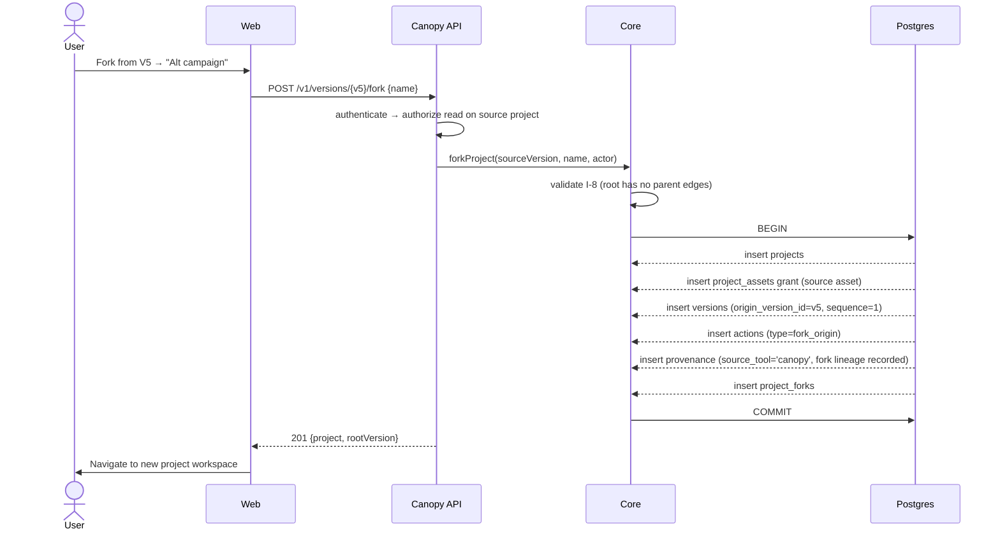

### 12.5 Surface behaviour

| Surface | Fork behaviour |
|---|---|
| Web | Button on the version detail panel and on the lineage node context menu. Navigates to the new project. P0. |
| Android | Visible as a project with an "Origin" chip that deep-links upstream. Fork *creation* is FUTURE. |
| MCP | `canopy_get_version` returns `origin` when present. Fork as a write tool is FUTURE. |
| Future integrations | A plugin may fork to isolate an experiment; same endpoint. |

---

## 13. Merge

### 13.1 Definition

> **Canopy Merge** combines compatible creative directions into a new immutable version with two or more parents. It is not Git three-way raster merging.

The insight that makes this implementable: **Canopy stores operations, not just results.** Two divergent branches are two ordered lists of typed, parameterised operations applied to a common ancestor. Merging those lists is a tractable problem with a real algorithm.

### 13.2 Strategies

| Strategy | When it applies | Determinism | Priority |
|---|---|---|---|
| `operation` | Both sides contain only replayable ops since the LCA | Fully deterministic. `asset = replay(lca_asset, merged_ops)` | **P0** |
| `manual` | Any case; user resolves in the editor and commits with two declared parents | Deterministic (it is a normal commit with extra parents) | **P0** |
| `ai_composite` | At least one side contains a non-replayable op (an AI generation) | Non-deterministic; AI-assisted | **P2** |

If `operation` is unavailable and `ai_composite` is not built or fails, the UI offers `manual` and says why. It never silently degrades.

### 13.3 Operation merge algorithm

```
mergeVersions(A, B, resolutions):
  lca        := findLCA(A, B)                        # §11.3
  opsA       := collectOps(lca → A)                  # concatenate action.params along the path
  opsB       := collectOps(lca → B)
  if any op in opsA ∪ opsB is not replayable:
      return ConflictReport(reason = NON_REPLAYABLE, suggest = [ai_composite, manual])

  normalise(opsA); normalise(opsB)                   # coalesce same-type ops per side
  conflicts  := detectConflicts(opsA, opsB)          # §13.4
  unresolved := conflicts - resolutions.keys
  if unresolved is not empty:
      return ConflictReport(conflicts = unresolved)  # 409, no version created

  merged     := compose(opsA, opsB, resolutions)     # §13.5
  asset      := renderPipeline(lca.asset, merged)    # sharp, server-side
  version    := createVersion(
                  project, asset,
                  parents = [A (index 0, primary), B (index 1, merge_source)],
                  action  = { type: 'merge',
                              params: { strategy:'operation', lca_version_id: lca.id,
                                        resolutions, merged_ops: merged } },
                  actor   = human)
  return version
```

### 13.4 Conflict taxonomy

| Conflict | Definition | Default resolution offered |
|---|---|---|
| `ADJUST_OVERLAP` | Both sides set the same adjustment channel (both changed brightness) | Take A / take B / **average** / enter a value |
| `GEOMETRY_INCOMPATIBLE` | Both sides cropped, or one cropped and one resized, producing different output frames | Take A / take B. No automatic blend. |
| `TEXT_COLLISION` | Both sides added a text overlay whose bounding boxes intersect by >20% | Take A / take B / keep both and offset |
| `NON_REPLAYABLE` | Either side contains `ai_generate`, `ai_edit`, `merge`, or `fork_origin` after the LCA | Not resolvable by operation merge. Escalate to `ai_composite` or `manual`. |
| `ORDER_SENSITIVE` | Both sides contain ops whose composition is order-dependent (rotate + crop) | Present both orderings with previews; user picks |

Non-conflicting ops (A adjusted brightness, B added text) compose automatically with **no user interaction** — this is the case the demo should show, because it makes the point instantly.

### 13.5 Composition order

Deterministic and documented, so results are reproducible:

1. Geometry first: `crop` → `rotate` → `flip` → `resize`
2. Then tonal: `adjust`
3. Then overlays: `text_overlay`, in (side A, then side B) order unless a resolution reorders them

Within a category, side A's ops precede side B's. This ordering is a constant in `packages/domain/merge/order.ts` and is asserted by a test.

### 13.6 AI-assisted merge (P2)

When a side is non-replayable, `ai_composite` sends both parent images plus a generated instruction to Gemini as a multi-reference edit. Gemini's image models accept multiple reference images, which is exactly the shape this needs.

Rules:
- The instruction is **derived from the declared deltas** of both sides, not free-typed by the user, so the merge is explainable: "Combine the background treatment from V7 with the typography from V4."
- The result is marked `actor_type = model`, with provenance recording both source versions as references.
- The resulting action records `strategy: 'ai_composite'` and a `determinism: 'non_deterministic'` flag, which the UI surfaces. Never present an AI composite as a deterministic merge.
- If Gemini fails or returns an unusable result, fall back to `manual`. Do not retry more than once.

### 13.7 Merge UI (Web)

Three-pane: **Side A preview | Merge preview | Side B preview**, with a conflict list below. Each conflict row is a segmented control. The merge preview re-renders on resolution change via a `POST /v1/merges/preview` call that returns a preview asset without creating a version. Commit is a separate, explicit action.

### 13.8 Merge across surfaces

| Surface | Behaviour |
|---|---|
| Web | Full: preview, conflict resolution, commit. P0 (operation + manual). |
| Android | Read-only: a merge version renders with two parent chips and its strategy. Merge creation is FUTURE. |
| MCP | `canopy_compare_versions` can report merge-ability. Merge as a write tool is FUTURE. |

### 13.9 Failure handling

| Failure | Response |
|---|---|
| No LCA found (versions in different projects) | `400 MERGE_CROSS_PROJECT` |
| A == B | `400 MERGE_SELF` |
| One is an ancestor of the other | `400 MERGE_LINEAR` — "V7 already contains V4; nothing to merge." |
| Unresolved conflicts | `409 MERGE_CONFLICTS` with the conflict report. No partial state. |
| Render failure during bake | `500 MERGE_RENDER_FAILED`, transaction rolled back, no version, no orphan asset |

---

## 14. Creative Memory

### 14.1 The distinction that justifies the subsystem

| | Lineage | Memory |
|---|---|---|
| Answers | **What happened** | **What it meant** |
| Nature | Immutable fact | Mutable interpretation |
| Example | "V7 was created by `ai_edit` with instruction 'make the background warmer'" | "The client rejects blue-dominant backgrounds; they read as corporate" |
| Derivable from the other? | No | No |
| Lifecycle | Append-only forever | Created, superseded, archived |

**The rule that prevents M1's feared duplication (I-10):** a memory must not state a fact that a lineage query can return. "V4 used the cinematic prompt" is not a memory — it is a provenance lookup. "We prefer cinematic framing for hero shots" is a memory.

### 14.2 Memory types

| `type` | Captures | Retrieval weight |
|---|---|---|
| `goal` | What this project is trying to achieve | Always included in Copilot context |
| `constraint` | Hard limits: brand colours, aspect ratios, forbidden elements | Always included |
| `preference` | Soft directional leanings | Retrieved on relevance |
| `decision` | A choice made and why | Retrieved on relevance |
| `rejection` | A direction tried and abandoned, with the reason | Retrieved on relevance |
| `insight` | An observation about what works | Retrieved on relevance |

### 14.3 Memory record shape

```
Memory {
  id: uuid
  project_id: uuid
  type: 'goal'|'constraint'|'preference'|'decision'|'rejection'|'insight'
  statement: text                    // the claim, one sentence, imperative or declarative
  rationale: text?                   // why
  source_refs: jsonb                 // { version_ids: [], diff_ids: [], message_ids: [] }
  origin: 'user_authored'|'ai_extracted'|'system'
  status: 'proposed'|'active'|'superseded'|'archived'
  superseded_by_memory_id: uuid?
  confidence: numeric(3,2)?          // only meaningful when origin='ai_extracted'
  embedding: vector(768)?
  created_by_user_id: uuid
  created_at / updated_at: timestamptz
}
```

### 14.4 Lifecycle rules

| Rule | Detail |
|---|---|
| Creation (user) | `origin='user_authored'`, `status='active'` immediately. |
| Creation (AI) | `origin='ai_extracted'`, `status='proposed'` **always**. A proposed memory is never used in Copilot context and never shown as fact. |
| Confirmation | A user promotes `proposed → active`. This is the R-12 confirmation pattern applied to memory. |
| Editing | Editing an active memory creates a **new** memory row and sets the old one to `superseded`, with `superseded_by_memory_id` set. Interpretations change; the record of having changed them is kept. |
| Deletion | Soft only: `status='archived'`. No hard delete endpoint exists. |
| Isolation | Memory is scoped to one project. Forks do not inherit memory by default (§12.2). |

### 14.5 Memory creation flow

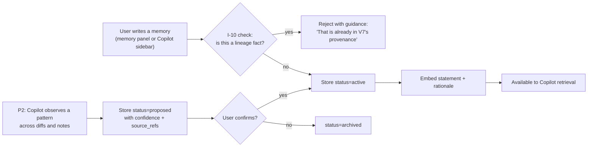

The I-10 check in MVP is a lightweight heuristic plus a UI hint, not a hard AI gate: reject statements matching `/\bV\d+\b/` that contain no interpretive verb. Full semantic checking is FUTURE.

### 14.6 Retrieval contract

`searchMemory(projectId, query, { types?, limit })` returns:
1. **Always**: all `active` memories of type `goal` and `constraint` (capped at 20).
2. **Plus**: top-k `active` memories by hybrid score — `0.6 × cosine(embedding, query_embedding) + 0.4 × ts_rank(tsv, websearch_to_tsquery(query))`.
3. **Never**: `proposed`, `superseded` or `archived` memories.

### 14.7 Memory across surfaces

| Surface | Behaviour | Priority |
|---|---|---|
| Web | Memory panel: list, create, edit, archive, filter by type. Memories cited in Copilot answers link back here. | P0 |
| Android | Read-only list + Copilot citations | P2 |
| MCP | `canopy_get_memory` read tool. `canopy_create_memory` write tool. | Read P1, write P2 |

---

## 15. Semantic Diff

### 15.1 Architecture (M1 R-01, retained and specified)

Three evidence sources, in descending trust order. Never a single vision call.

| # | Source | Method | Cost | Availability |
|---|---|---|---|---|
| 1 | **Declared delta** | Read `actions.declared_delta` along the path A→B | Zero, deterministic | Always, for any two connected versions |
| 2 | **Path summary** | Text LLM (Grok) summarises the ordered declared deltas into a narrative | ~1 cheap text call | Whenever a path exists |
| 3 | **Observed delta** | Vision model (Gemini) compares the two rendered assets against a fixed facet schema | 1 multimodal call | Whenever both assets are readable and the provider is up |

### 15.2 Pipeline

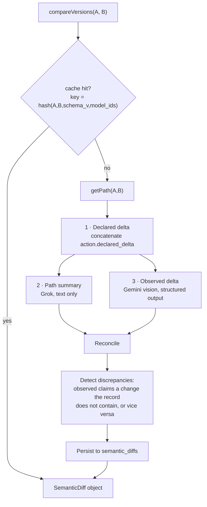

Sources 2 and 3 run **in parallel**. Source 1 gates both: if there is no path, the diff is marked `unconnected` and only source 3 runs, with `confidence: low` and an explicit note that the versions are not on a common path.

### 15.3 Output schema (normative)

```
SemanticDiff {
  id: uuid
  from_version_id, to_version_id: uuid
  status: 'complete' | 'partial' | 'declared_only' | 'failed'
  path: { version_ids: [], length: int, crosses_branch_point: bool } | null
  summary: string                       // 1–2 sentences, plain language
  facets: {
    composition?:   FacetChange
    framing?:       FacetChange
    lighting?:      FacetChange
    color?:         FacetChange
    background?:    FacetChange
    subject?:       FacetChange
    objects?:       FacetChange
    style?:         FacetChange
    typography?:    FacetChange
  }
  contribution: {
    human: { version_ids: [], summary: string }
    model: { version_ids: [], summary: string, models_used: [] }
  }
  discrepancies: [ { facet, declared, observed, note } ]
  confidence: { declared: 1.0, path: 0..1, observed: 0..1, overall: 0..1 }
  evidence_used: ['declared'|'path'|'observed']
  created_at
}

FacetChange {
  changed: boolean
  description: string
  evidence: 'declared' | 'observed' | 'both'
}
```

`evidence` per facet is what makes the UI honest: a facet derived from the action record renders with a record icon; one derived from vision renders with a model icon and its confidence.

### 15.4 Discrepancy handling

When observed and declared disagree — for example vision reports "background changed" but no path operation touched the background:

1. Both claims are stored.
2. `overall` confidence is reduced by 0.2 per discrepancy, floored at 0.3.
3. The UI shows both with a divergence marker: *"The record shows only a brightness adjustment. Visual analysis also reports a background change. Showing both."*

**Never** silently prefer one. This is a product differentiator, not a defect — it is what a system of record should do.

### 15.5 Caching and invalidation

`cache_key = sha256(from_id || to_id || facet_schema_version || diff_model_ids)`. Unique index. Versions are immutable, so a cached diff is valid forever unless the schema version or model changes. No invalidation logic is needed, which is a direct benefit of immutability.

### 15.6 Failure handling

| Failure | Result |
|---|---|
| Vision provider error, timeout (>20s) or rate limit | `status='partial'`, `evidence_used=['declared','path']`. UI: "Visual analysis unavailable. Showing the change record." |
| Vision returns malformed JSON | One repair retry with a stricter instruction; on second failure treat as provider error |
| Text provider fails | `status='declared_only'`, facets from the record only |
| Both AI providers fail | `status='declared_only'`. **Diff still works.** This is the fallback demo. |
| No path between versions | `path: null`, observed-only, `confidence.overall ≤ 0.5` |

---

## 16. Provenance

### 16.1 Record shape

```
Provenance {
  id: uuid
  version_id: uuid
  actor_type: 'human' | 'model'
  source_tool: text                  // 'canopy_web'|'canopy_android'|'canopy_mcp'|external tool name
  capture_fidelity: 'full'|'partial'|'output_only'

  // model actors only:
  provider: text?                    // 'gemini'
  model: text?                       // 'gemini-3.1-flash-image'
  model_version_reported: text?      // whatever the provider echoed back
  prompt: text?                      // exactly as submitted, never paraphrased
  instruction: text?                 // for edits
  parameters: jsonb?                 // aspect ratio, seed, safety settings, reference version ids
  provider_request_id: text?
  seed: text?
  watermark: text?                   // e.g. 'synthid' when the provider states one is embedded
  missing_fields: text[]             // REQUIRED. Names every field the provider did not supply.

  // inbound assets:
  inbound_c2pa_present: boolean      // detection only, FUTURE to parse
  external_ids: jsonb?
  created_at
}
```

### 16.2 The `missing_fields` rule (I-6)

Providers differ in what they return. Some expose a seed and a full parameter echo; some return only bytes. Canopy records the gap rather than hiding it. If Gemini does not return a seed, `missing_fields` contains `"seed"` and the UI renders "Seed: not reported by provider" instead of a blank. Silence is not the same as absence, and a provenance system that cannot tell them apart is not a provenance system.

### 16.3 Capture fidelity tiers (M1 R-14)

| Tier | Meaning | Sources | UI treatment |
|---|---|---|---|
| `full` | Canopy performed the action and holds all parameters | Web, Android, MCP writes, Canopy-invoked providers | Full provenance card |
| `partial` | An external tool supplied the asset plus some declared metadata | FUTURE plugins on a save event | Card with an "as reported by {tool}" banner |
| `output_only` | Only the asset is known; parameters are lost | FUTURE browser extension | Card explicitly stating parameters are unavailable |

A version's fidelity is never upgraded after the fact.

### 16.4 Relationship to C2PA (M1 R-13, retained)

Canopy records **internal** provenance only and makes **no** standards-compliance claim in product, docs or pitch. Two relevant facts inform the roadmap rather than the MVP:

- Gemini-generated images carry a SynthID watermark per Google's documentation. Canopy records `watermark: 'synthid'` as a **reported** field. It does not verify it, and must not claim to.
- The ecosystem's unsolved problem is that distribution intermediaries strip embedded manifests. Canopy's ledger lives beside the file rather than inside it, which is complementary positioning worth stating and worth building toward later.

FUTURE, separately scoped and never claimed until tested: reading inbound C2PA manifests on import; signing exports as a conforming producer.

---

## 17. AI Architecture

### 17.1 Principles

1. Intelligence is a **consumer** of Core. It never writes to `versions`, `actions`, `provenance` or `assets`. The one exception is `generateVersion`, which is a **Core** operation that *calls* a provider — the provider does not write; Core does.
2. No read path depends on a model call succeeding.
3. Every provider call is logged to `ai_requests` with latency, tokens and cost before the response is returned.
4. Provider types never escape the adapter. `operations/` and `intelligence/` see only Canopy types.

### 17.2 Provider abstraction

```
interface AIProvider {
  readonly id: string                       // 'gemini' | 'grok'
  capabilities(): CapabilitySet             // declared, not assumed

  generateImage?(req: ImageGenRequest): Promise<ImageResult>
  editImage?(req: ImageEditRequest): Promise<ImageResult>
  analyseImages?(req: VisionRequest): Promise<StructuredResult>
  complete?(req: TextRequest): Promise<TextResult>
  completeStream?(req: TextRequest): AsyncIterable<TextChunk>
  plan?(req: PlanRequest): Promise<ToolCall[]>     // function calling
  embed?(req: EmbedRequest): Promise<number[][]>
}

CapabilitySet = {
  imageGeneration: bool, imageEditing: bool, multiReferenceEdit: bool,
  vision: bool, structuredOutput: bool, functionCalling: bool,
  streaming: bool, embeddings: bool, maxInputImages: int
}

ImageResult = {
  bytes: Buffer, mime: string,
  reportedModel: string?, providerRequestId: string?, seed: string?,
  watermark: string?, parametersEcho: object?,
  missingFields: string[]                   // computed by the adapter, never empty by accident
}
```

A **capability registry** maps each Canopy task to an ordered provider list. The registry, not the calling code, decides who serves a task:

| Task | Primary | Secondary | If both fail |
|---|---|---|---|
| Image generation | Gemini | — | Typed error; no version created |
| Image edit | Gemini | — | Typed error; no version created |
| Observed delta (vision) | Gemini | Grok (accepts image input) | `status='declared_only'` |
| Copilot planning + answering | Grok | Gemini text | Deterministic fallback answer from structured data only |
| Version summary | Grok | Gemini text | Store `summary = null`; diff and Copilot still work |
| Memory extraction (P2) | Grok | — | Feature silently unavailable |
| Embeddings | Gemini embedding model | — | Semantic search disabled; structured search still works |

Secondary providers are P1. The registry shape is P0 so adding them is configuration.

### 17.3 AI request logging

Every call writes an `ai_requests` row: project, purpose, provider, model, status, latency, input/output tokens, estimated cost, error code, and a **prompt preview truncated to 200 characters**. Never log full prompts containing user content beyond the preview, never log API keys, never log image bytes.

### 17.4 Budget guard

A per-project daily token/cost ceiling read from config. On breach, AI features return `429 AI_BUDGET_EXCEEDED` and the UI degrades to declared-only diff and structured-only Copilot. This exists so a runaway loop during the build cannot exhaust the demo's credits at hour 22.

---

## 18. Gemini Integration

### 18.1 Verified capability notes

Research conducted for this blueprint (September 2026). **Agents must re-verify model IDs against the live docs before the first call; do not trust these strings blindly.**

- Google's Gemini image models are documented under the "Nano Banana" family, with `gemini-3-pro-image` (Nano Banana Pro) as the high-quality tier, `gemini-3.1-flash-image` (Nano Banana 2) documented as the versatile generalist balancing speed with 4K generation and reliable text rendering, and `gemini-3.1-flash-lite-image` as the fastest and cheapest tier, noted as not optimised for multiple reference inputs or multi-turn sequential editing.
- The models support conversational generation **and native image editing**, including multi-reference input — which is what `ai_composite` merge (§13.6) requires.
- Google documents a SynthID watermark on generated images.
- Endpoint shape is `generateContent` on the Gemini API.

### 18.2 Canopy's assignment

| Canopy task | Model | Rationale |
|---|---|---|
| `ai_generate` (text → image) | `gemini-3.1-flash-image` | Default. Speed matters more than maximum quality in a live demo. |
| `ai_edit` (instruction + image → image) | `gemini-3.1-flash-image` | Native editing; single reference |
| `ai_composite` merge (P2) | `gemini-3-pro-image` | Needs multi-reference handling; quality tier justified for a rarer, higher-stakes call |
| Observed delta (vision) | Gemini text/multimodal model with structured output | Two images + facet schema → JSON |
| Embeddings | Gemini embedding model, 768 dimensions | Matches `vector(768)` columns |

Model IDs live in `config/models.ts` as named constants, never inline. Changing a tier is a one-line config change.

### 18.3 Generation flow

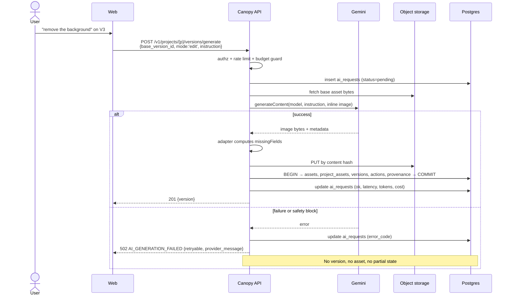

### 18.4 Safety and failure specifics

| Case | Handling |
|---|---|
| Safety filter blocks the prompt | `422 AI_CONTENT_BLOCKED` with the provider's category if given. Not retried. User-visible, non-alarming copy. |
| Timeout | 60s ceiling for generation, 20s for vision. One retry with jitter for network-class errors only. |
| Rate limit | Surface `429` with `retry_after`. Do not auto-retry in a loop. |
| Returned image unreadable / zero bytes | Treat as provider failure. No version. |
| Provider omits seed / parameters | Normal. Record in `missing_fields`. Not an error. |

---

## 19. Grok Integration

### 19.1 Verified capability notes

Research conducted for this blueprint (September 2026). **Re-verify before first call.**

- xAI's API is **OpenAI-compatible**, with base URL `https://api.x.ai/v1`, which means the adapter can use a standard OpenAI-shaped SDK and the integration cost is low.
- The current flagship is documented as **Grok 4.6** (released August 2026), supporting reasoning, **function calling**, and **structured outputs**, accepting text and image inputs and returning text, with a large context window.
- Structured outputs via JSON schema and tool/function calling are documented across the Grok 4.x line — both are hard requirements for Canopy's query planner.
- Image input support means Grok can serve as the **secondary** vision provider for observed delta.

### 19.2 Canopy's assignment

| Canopy task | Why Grok |
|---|---|
| **Copilot query planning** | Function calling maps cleanly onto Canopy's closed history-operation set (§20.3) |
| **Copilot answering** | Grounded synthesis over retrieved rows, streamed |
| **Path summary** (diff source 2) | Cheap text task over declared deltas |
| **Version summary** at commit | One short call per version |
| **Memory extraction** (P2) | Structured output → proposed memories with confidence and source refs |
| Observed delta fallback | Accepts image input; used only when Gemini vision fails |

Model constant: `GROK_REASONING_MODEL` in `config/models.ts`. A cheaper Grok tier is configured separately for summaries (`GROK_SUMMARY_MODEL`) — summaries are high-volume and low-stakes.

### 19.3 Structured output discipline

Every non-conversational Grok call requests a JSON schema and the result is parsed with Zod. On parse failure: one repair attempt with the validation error appended, then fail the feature gracefully. Never `JSON.parse` a model response without schema validation; never feed an unvalidated model object into a database write.

---

## 20. Copilot

### 20.1 Architecture (M1 R-02, retained and specified)

Copilot is **query-planning first, retrieval second**. It does not embed the history and hope. It maps a question onto a closed set of history operations, receives exact rows, and narrates them with citations drawn only from those rows.

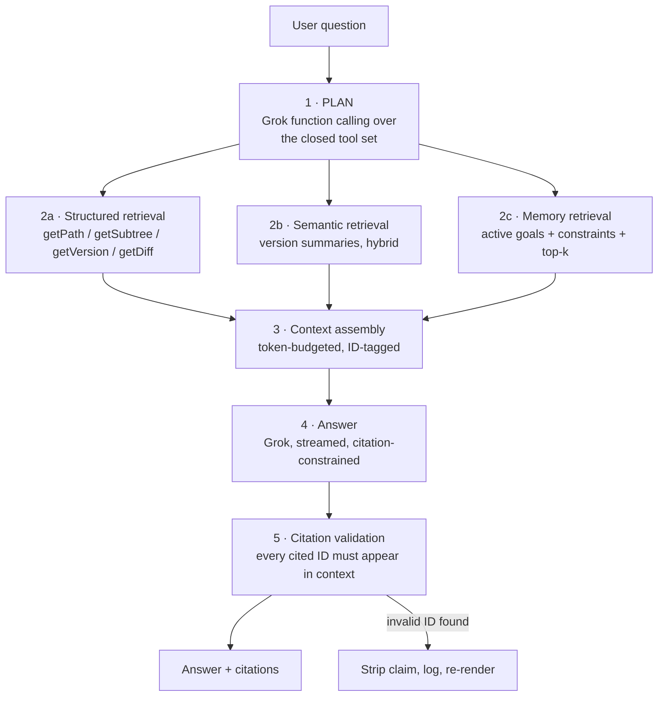

### 20.2 Why this makes hallucination tractable

The model can only cite IDs that were placed in its context by a retrieval call. A post-generation validator rejects any citation not present in the assembled context. A claim about a version that was never retrieved cannot survive the validator. This converts "hallucination prevention" from a prompting hope into a mechanical check.

### 20.3 The closed tool set (planner functions)

| Tool | Params | Returns |
|---|---|---|
| `get_version` | `version_ref` (id or "V7") | Version + action + provenance |
| `get_path` | `from_ref`, `to_ref` | Ordered versions with declared deltas |
| `get_subtree` | `version_ref`, `depth?` | Descendants |
| `get_children` | `version_ref` | Direct children |
| `get_lineage_overview` | — | Compact graph: ids, sequences, actor types, branch points |
| `get_diff` | `from_ref`, `to_ref` | Cached or freshly computed semantic diff |
| `search_versions` | `query`, `limit` | Hybrid search over version summaries + prompts |
| `search_memory` | `query`, `types?` | Active memories |
| `list_ai_generations` | `limit?` | Model-actor versions with prompts and models |

Maximum 4 planner rounds per question, hard cap. If the planner has not converged, answer from what was retrieved and say the question could not be fully resolved.

### 20.4 Reference resolution

"V7", "the last AI version", "the one with the red background" must resolve to IDs before retrieval. Resolution order: explicit sequence label (`V7` → `sequence=7` in this project) → relative reference (`the last AI version` → most recent `actor_type='model'`) → semantic search fallback. Ambiguity produces a clarifying question rather than a guess.

### 20.5 Context assembly format

Every retrieved object is rendered into context with an explicit, citable ID:

```
[VERSION V7 · id=ver_9f3a · actor=model · model=gemini-3.1-flash-image
 · created=2026-09-20T11:04Z · parents=[V6]]
 action: ai_edit — instruction: "warm the background tones"
 declared_delta: color: warmer background; background: tone shift
 summary: "AI warmed the background while keeping the subject unchanged."

[MEMORY mem_41 · type=constraint · status=active]
 statement: "Client rejects blue-dominant backgrounds."
 rationale: "Reads as corporate for this brand."
 source_refs: versions [V4, V5]
```

Token budget: 12,000 for context, reserving the rest for the answer. Truncation drops in this order: semantic search results → subtree detail → path intermediate versions (keeping endpoints) → memory of type `insight`. Goals and constraints are never dropped.

### 20.6 Answer contract

```
CopilotAnswer {
  text: string                          // streamed
  citations: [
    { kind: 'version', id, sequence, label? } |
    { kind: 'memory',  id, type } |
    { kind: 'diff',    id, from_sequence, to_sequence }
  ]
  tools_used: string[]
  grounded: boolean                     // false ⇒ answered from no retrieved rows
  created_at
}
```

If `grounded=false`, the UI renders the answer with a "not grounded in project history" marker. The model is instructed to say it cannot determine an answer rather than infer one — and the validator enforces that any specific version claim without a citation is stripped.

### 20.7 Questions the demo must answer correctly

These are also the AI evaluation set (§34.5). Ground truth is fixed in the seed project.

| Question | Expected tools | Expected citation shape |
|---|---|---|
| "What changed between V4 and V8?" | `get_path`, `get_diff` | Versions V4–V8 |
| "Why did we change the background?" | `search_memory`, `get_path` | ≥1 memory + ≥1 version |
| "Which version introduced this direction?" | `search_versions`, `get_lineage_overview` | 1 version |
| "What did we reject?" | `search_memory` (type=rejection) | Memories + referenced versions |
| "What design preferences have we learned?" | `search_memory` (type=preference) | Memories only |
| "What was the last AI-generated version?" | `list_ai_generations` | 1 version with model name |
| "Which creative direction produced the current version?" | `get_ancestors`/`get_path` | Path from branch point |

### 20.8 Streaming and errors

SSE from `POST /v1/projects/:id/copilot/messages`. Events: `plan` (tool names, for a visible "consulting history" state), `token`, `citations`, `done`, `error`. On provider failure mid-stream, emit `error` and keep the partial text with a failure marker — never a silently truncated answer.

---

## 21. MCP Architecture

### 21.1 Position

MCP is an **interface into Canopy**, not a product. The MCP server holds no domain logic and no database access. It translates MCP tool calls into Canopy API calls over HTTP using a scoped token, which means every MCP request passes through the same authentication, authorization, validation and invariant checks as a Web request. **MCP never bypasses Core validation.**

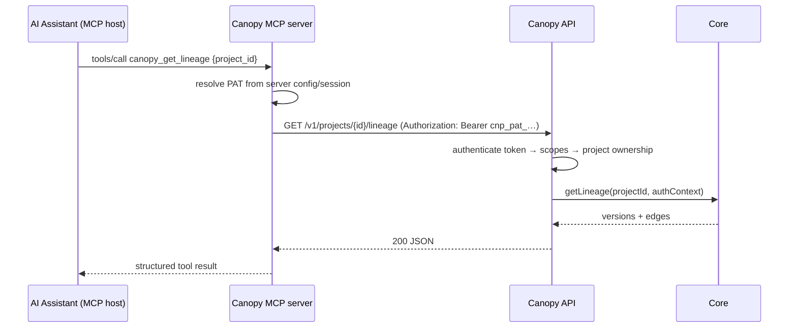

### 21.2 Protocol version pinning (critical)

The MCP specification underwent a large revision in 2026 that replaced the stateful initialize handshake with a **stateless core**, moved per-request protocol version and capability declaration into a reserved `_meta` field, introduced a `server/discover` method, and deprecated several earlier features. SDKs adopt revisions at their own pace and older revisions remain in use.

**Rules for the implementing agent:**
1. Use the **official MCP TypeScript SDK** and whatever revision that SDK implements. Do not hand-roll a server against specification prose under time pressure.
2. Record the pinned revision in `services/mcp/PROTOCOL.md` and in the server's build metadata.
3. Verify with the MCP Inspector before the demo. Budget 20 minutes for this; protocol mismatches are silent and infuriating.
4. If the SDK version and the target host disagree, downgrade the SDK rather than patching the protocol.

### 21.3 Tool surface

**Read tools (P1 — built if Phases 0–8 are on schedule):**

| Tool | Input | Output | Notes |
|---|---|---|---|
| `canopy_list_projects` | — | Projects visible to the token | Scope `projects:read` |
| `canopy_get_project` | `project_id` | Project + counts + goal + tip versions | |
| `canopy_get_lineage` | `project_id` | Versions, edges, branch points | Capped at 2,000 nodes |
| `canopy_get_version` | `version_id` | Version + action + provenance + asset URL (signed, 10 min) | |
| `canopy_compare_versions` | `from_id`, `to_id` | Semantic diff (cached or computed) | May take up to 20s; document the latency |
| `canopy_search_history` | `project_id`, `query` | Hybrid search over versions | |
| `canopy_get_memory` | `project_id`, `type?` | Active memories | |

**Write tools (P2 / FUTURE — only if all P0 and P1 work is complete):**

| Tool | Guardrails |
|---|---|
| `canopy_create_memory` | Scope `memory:write`. Created as `status='proposed'`, never `active`. Requires human confirmation in Canopy. |
| `canopy_continue_from` | Scope `versions:write`. Creates a working state, **not** a version. The human commits. |
| `canopy_create_version` | **FUTURE.** Not in this build. Writing creative history from an assistant needs a confirmation UX that does not exist yet. |

This split is the R-12 principle applied to MCP: machines propose, humans commit.

### 21.4 Authentication and authorization

- Credential: a Canopy **personal access token** (`cnp_pat_…`), created in Web settings, stored hashed (SHA-256) in `api_tokens`, shown once.
- Scopes: `projects:read`, `versions:read`, `memory:read`, `memory:write`, `versions:write`. Read scopes only by default.
- The MCP server holds the token in its own environment; it never sees a user password and cannot mint tokens.
- Every API call re-verifies token validity, scope, and project ownership at the repository layer (I-11). A revoked token fails on the next call.
- Rate limit: 60 requests/minute per token, 10/minute for `canopy_compare_versions` because it can invoke a vision model.

### 21.5 Errors, logging, isolation

- Tool errors return MCP-structured failures with a stable Canopy error code and a human-readable message. Never leak stack traces, SQL, or provider payloads.
- Every MCP call logs: token id (not the token), tool name, project id, latency, outcome. Logged to `ai_requests`-adjacent MCP log or structured application log.
- Project isolation is enforced server-side per request. A token scoped to a user can reach only that user's projects, and `getLineage` refuses to build a query without an `AuthContext`.

### 21.6 Future extensibility

MCP resources (exposing a project as a browsable resource tree), subscriptions (notify on new version), and richer capability negotiation are FUTURE. Tools alone carry the demo and the near-term value.

---

## 22. Web Architecture

### 22.1 Stack

| Concern | Choice | Reason |
|---|---|---|
| Framework | **Next.js (App Router), TypeScript** | Fast scaffold, file routing, good agent familiarity, Vercel deploy in minutes |
| Rendering | Client-heavy SPA behaviour inside the app shell | The workspace is stateful and interactive; SSR buys little here |
| Server state | **TanStack Query** | Caching, invalidation, retries, optimistic updates without hand-rolling |
| Client state | **Zustand** | Editor working state, selection, panel layout. Small, no boilerplate. |
| Styling | **Tailwind CSS** + a small local primitives set | Density and speed; no heavyweight component library to fight |
| Canvas editor | **Konva via react-konva** | Scene-graph model with official React bindings and multi-layer rendering; the React integration is what matters at this timescale |
| Lineage graph | **React Flow** + **dagre** layout | Node/edge rendering, pan/zoom, custom nodes and selection out of the box; dagre gives a clean DAG layout |
| Forms/validation | **Zod** (shared from `packages/schemas`) | One schema, client and server |
| Streaming | Native `EventSource` / fetch streams for Copilot SSE | |

**Explicitly not used:** Redux, a component kitchen-sink library, a CSS-in-JS runtime, a state machine library, tRPC (the API must be consumable by Android and MCP, so it stays plain REST with an OpenAPI document).

### 22.2 Routes

| Route | Purpose |
|---|---|
| `/` | Landing / sign-in |
| `/projects` | Project list, create project |
| `/projects/[id]` | **Workspace** (default view: canvas + lineage) |
| `/projects/[id]/versions/[versionId]` | Version detail (deep-linkable, used by Android and MCP links) |
| `/projects/[id]/compare?from=&to=` | Compare + semantic diff |
| `/projects/[id]/merge?a=&b=` | Merge resolution |
| `/projects/[id]/memory` | Creative Memory panel (also available as a drawer in the workspace) |
| `/settings/tokens` | Personal access tokens for MCP/CLI |

### 22.3 Workspace layout

```
┌──────────────────────────────────────────────────────────────┐
│ TOP BAR  project name · goal · Save Version · Generate · Fork │
├────────┬────────────────────────────────────┬────────────────┤
│ LEFT   │ CENTER                             │ RIGHT          │
│ tools  │ canvas (react-konva)               │ tabs:          │
│ crop   │ working-state preview              │  Properties    │
│ adjust │                                    │  Provenance    │
│ text   │                                    │  Diff          │
│ rotate │                                    │  Copilot       │
│ flip   │                                    │  Memory        │
├────────┴────────────────────────────────────┴────────────────┤
│ BOTTOM  LINEAGE RAIL — React Flow DAG, human/model colouring │
└──────────────────────────────────────────────────────────────┘
```

The lineage rail is collapsible and expands to a full-height canvas. On tablet widths the right panel becomes a sheet; the editor is desktop-only and mobile web redirects to the read-only version view.

### 22.4 Feature module boundaries

```
apps/web/src/
  app/                    routes only, thin
  features/
    projects/             list, create, project header
    editor/               canvas, tools, working-state store, commit flow
    lineage/              React Flow graph, node types, layout, selection
    versions/             detail panel, provenance card, annotations
    compare/              side-by-side, diff rendering, facet cards
    merge/                three-pane, conflict resolution, preview
    memory/               list, create, edit, archive
    copilot/              chat panel, streaming, citation chips
    ai/                   generate/edit dialogs, model selection, error states
    auth/                 sign-in, session, token settings
  lib/                    api client wrapper, query keys, formatting, hooks
  components/ui/          primitives: Button, Input, Panel, Dialog, Tabs, Badge, Tooltip
```

Rule: a feature folder may import from `lib/` and `components/ui/` but **not** from another feature folder. Cross-feature needs go through `lib/` or a route-level composition. This is the boundary that keeps parallel agents from colliding (§37).

### 22.5 Editor: the commit flow (the most important interaction)

1. User opens a version → working state initialises with `base_version_id` and an empty op list.
2. Tool interactions append typed ops to the Zustand store. Adjustments apply as CSS filters on the Konva layer — instant, no server call.
3. Consecutive same-type ops on the same target coalesce (three brightness drags → one `adjust` op).
4. "Save Version" opens a small dialog: optional label, optional note, and a **plain-language summary of the ops about to be committed** ("Brightness +12, cropped to 4:5, added text 'SUMMER'"). This makes the commit gesture deliberate and legible.
5. `POST /v1/projects/:id/versions` with `{ base_version_id, ops, label, note, idempotency_key }`.
6. Server validates ops, bakes the asset, writes the version, returns it.
7. Client clears working state, sets the new version as base, animates the new node into the lineage rail.

**The client never sends pixels.** See §9.4.

### 22.6 Optimistic updates

Version creation is **not** optimistic — the server assigns the id, sequence and baked asset, and a wrong optimistic node in a lineage graph is worse than a 900ms spinner. Memory creation and annotation edits **are** optimistic. The commit dialog shows determinate progress: `uploading → rendering → committing`.

### 22.7 Performance targets

| Interaction | Target |
|---|---|
| Adjustment preview | <16ms (local filter) |
| Lineage render, 200 nodes | <300ms |
| Version switch (cached asset) | <150ms |
| Commit round trip | <1.5s p50 |
| Diff, cached | <200ms |
| Diff, cold with vision | <8s p50, 20s hard timeout |
| Copilot first token | <2s |

### 22.8 Accessibility and error states

Keyboard: `⌘K` command palette, `⌘S` commit, arrow keys traverse the lineage graph, `Esc` closes panels. All controls reachable by tab; focus rings visible. Every panel implements three states — loading (skeleton), empty (with the action that fills it), error (with cause and retry). No spinner without a cancel path after 10 seconds.

---

## 23. Android Architecture

### 23.1 Framework decision

**Kotlin + Jetpack Compose.** Not a WebView wrapper, not React Native, not Flutter.

| Criterion | Compose | React Native | Flutter | WebView |
|---|---|---|---|---|
| Camera + gallery (future capture) | Native, first-class | Bridge | Plugin | Poor |
| Image handling / memory | Best | Adequate | Good | Poor |
| Team language overlap with API (TS) | None | High | None | High |
| Long-term fit for a capture-first client | Best | Medium | Medium | Worst |
| Hackathon speed for 3 read-only screens | Adequate | Adequate | Adequate | Fast but disqualified |

Compose wins on the axis that matters beyond the hackathon (device capture and image handling) and the TS-overlap advantage of React Native is irrelevant because Android is P2 and will be built by a dedicated agent, not shared with the web agent. A WebView wrapper is explicitly rejected: it would make Android a disconnected demo, which the brief forbids.

### 23.2 Architecture

```
MVVM + unidirectional data flow

UI (Compose)  →  ViewModel (StateFlow<UiState>)  →  Repository
                                                      ├─ Remote: Ktor client + kotlinx.serialization
                                                      └─ Local:  Room (cache) + DataStore (tokens)
```

| Concern | Choice |
|---|---|
| Navigation | Navigation Compose, type-safe routes, deep links `canopy://project/{id}/version/{id}` |
| Networking | Ktor client (or Retrofit) generated against the API's OpenAPI document |
| Serialization | kotlinx.serialization, models generated from the same OpenAPI document the web client uses |
| Images | Coil, with a disk cache keyed by asset content hash (immutability makes this cache permanently valid) |
| Local store | Room for projects/versions/lineage cache; DataStore (encrypted) for tokens |
| DI | Hilt |
| Auth storage | EncryptedSharedPreferences / DataStore with the Android Keystore |

**Contract sharing:** the API emits an OpenAPI 3.1 document at build time from the Zod schemas. Android generates its models and client from that document. This is what makes "same Core, different surface" true rather than aspirational — the contract is mechanically shared, not re-typed.

### 23.3 MVP scope (P2 — three screens, read-only)

| Screen | Contents |
|---|---|
| **Projects** | List with thumbnail of the tip version, name, version count, last updated |
| **Lineage** | Vertical scrolling lineage: version thumbnails with actor badges (human / model), branch indentation, tap to open |
| **Version detail** | Full image, action, actor, model and prompt when AI, parents, sequence, and a Copilot question field |

Auth: sign in with the same credentials; token stored encrypted. Offline: Room cache serves the last-loaded project read-only with a stale banner.

### 23.4 Future Android

| Capability | Notes |
|---|---|
| Camera capture → import as version | The strongest mobile-native use case; needs an upload queue |
| Lightweight adjustments + commit | Reuses the same op list contract; renders server-side as on web |
| Offline commit queue | WorkManager, replayed through the same API, idempotency keys prevent duplicates on retry |
| Approve / reject a version | Requires collaboration, which is FUTURE |
| Push notifications | Only once collaboration exists; no value single-user |
| On-device embeddings | Rejected for now (M1 R-06); cloud inference is more appropriate at this scale |

### 23.5 Hard rule

Android is never allowed to block, delay or reshape P0/P1 work. If Phase 9 (MCP) slips, Phase 10 (Android) is cancelled without discussion, and the architecture document in this section is the deliverable.

---

## 24. Future Integration Architecture

### 24.1 The capture contract

Every external capture source, now or later, submits the same shape:

```
POST /v1/projects/{id}/captures
{
  asset: <multipart or signed-upload reference>,
  source_tool: string,                 // "figma" | "photoshop" | "browser_ext" | ...
  capture_fidelity: "partial" | "output_only",
  declared_ops?: EditOp[],             // only if the host can report them
  declared_provenance?: {              // only if the host exposes it
    provider?, model?, prompt?, parameters?
  },
  base_version_id?: string,            // if the host knows what it edited from
  external_id?: string,
  idempotency_key: string
}
```

Core creates a version with the declared fidelity. **A capture may never claim `full` fidelity.** Only Canopy-performed actions are `full`.

### 24.2 Host classification (M1 R-14, retained)

| Host | Realistic fidelity | Why |
|---|---|---|
| Canopy Web / Android / MCP | `full` | Canopy holds every parameter |
| Figma / Photoshop / Illustrator plugin | `partial` | Can read document state on a save event; cannot stream a fine-grained edit log |
| Browser extension over a third-party AI tool | `output_only` | Can observe the produced image; the generation parameters live inside that tool |
| CLI | `full` or `partial` | Depends on whether it invokes Canopy operations or uploads results |

The UI never presents an `output_only` capture as though its provenance were complete. This is the honesty requirement that makes the provenance claim credible.

### 24.3 Extension authentication

Scoped PATs with a `captures:write` scope, project-pinned, short expiry, revocable from `/settings/tokens`. No extension ever receives a user password or a long-lived broad credential. FUTURE: OAuth device flow for third-party extensions.

### 24.4 Future media

The three provisions from M1 R-16 are present from day one and nothing more is built:

1. `assets.media_type` (`image` in MVP)
2. Versions reference assets by id rather than assuming an image
3. `actions.type` is an open string with per-type schemas, not a database enum

A future video model reuses project, version, action, actor, lineage, fork and merge unchanged and adds timeline structures as **action parameters**. No timeline tables exist now.

---

## 25. Database Architecture

**PostgreSQL 16+, with `pgvector` in the same database.** A separate vector store is explicitly rejected (M1, and current guidance recommends starting with pgvector HNSW and moving only after measuring a specific limit — Canopy is orders of magnitude below that point).

ORM: **Drizzle** (typed, migration-friendly, thin). Migrations live in `database/migrations`, are forward-only, and are the only way schema changes happen.

### 25.1 `users`

| Column | Type | Constraints |
|---|---|---|
| `id` | uuid | PK, default gen_random_uuid() |
| `email` | citext | UNIQUE NOT NULL |
| `password_hash` | text | NOT NULL (argon2id) |
| `display_name` | text | NOT NULL |
| `created_at` | timestamptz | NOT NULL default now() |

### 25.2 `projects`

| Column | Type | Constraints |
|---|---|---|
| `id` | uuid | PK |
| `owner_id` | uuid | FK users(id) ON DELETE RESTRICT, NOT NULL |
| `name` | text | NOT NULL, length 1–120 |
| `creative_goal` | text | nullable, length ≤ 2000 |
| `version_sequence_counter` | integer | NOT NULL default 0 |
| `archived_at` | timestamptz | nullable (soft delete) |
| `created_at` / `updated_at` | timestamptz | NOT NULL |

Index: `idx_projects_owner (owner_id, archived_at)`.

### 25.3 `assets`

| Column | Type | Constraints |
|---|---|---|
| `id` | uuid | PK |
| `content_hash` | text | **UNIQUE NOT NULL** (sha256 hex) |
| `media_type` | text | NOT NULL default `'image'` |
| `mime` | text | NOT NULL |
| `storage_key` | text | NOT NULL |
| `thumb_storage_key` | text | nullable |
| `width` / `height` | integer | nullable |
| `byte_size` | bigint | NOT NULL |
| `created_at` | timestamptz | NOT NULL |

**No `project_id`.** Global deduplication; access is granted via `project_assets`. This is what makes fork free.

### 25.4 `project_assets`

| Column | Type | Constraints |
|---|---|---|
| `project_id` | uuid | FK projects(id) ON DELETE CASCADE |
| `asset_id` | uuid | FK assets(id) ON DELETE RESTRICT |
| `granted_at` | timestamptz | NOT NULL |

PK `(project_id, asset_id)`. **Every asset read is authorized through this table** — a signed URL is issued only if a grant exists for a project the caller can access.

### 25.5 `versions`

| Column | Type | Constraints |
|---|---|---|
| `id` | uuid | PK |
| `project_id` | uuid | FK projects(id) ON DELETE CASCADE, NOT NULL |
| `asset_id` | uuid | FK assets(id), NOT NULL |
| `sequence` | integer | NOT NULL |
| `actor_type` | text | NOT NULL, CHECK in ('human','model') |
| `actor_user_id` | uuid | FK users(id), nullable |
| `actor_provider` | text | nullable |
| `actor_model` | text | nullable |
| `actor_on_behalf_of_user_id` | uuid | FK users(id), nullable |
| `origin_version_id` | uuid | FK versions(id), nullable (fork roots only) |
| `is_root` | boolean | NOT NULL default false |
| `capture_fidelity` | text | NOT NULL default `'full'`, CHECK in ('full','partial','output_only') |
| `summary` | text | nullable (derived) |
| `summary_embedding` | vector(768) | nullable (derived) |
| `search_tsv` | tsvector | generated from summary + label |
| `created_at` | timestamptz | NOT NULL |

Constraints:
- UNIQUE `(project_id, sequence)`
- CHECK: `actor_type='human'` ⇒ `actor_user_id IS NOT NULL`
- CHECK: `actor_type='model'` ⇒ `actor_provider IS NOT NULL AND actor_model IS NOT NULL AND actor_on_behalf_of_user_id IS NOT NULL`

Indexes: `(project_id, created_at DESC)`, `(project_id, actor_type)`, HNSW on `summary_embedding` (`vector_cosine_ops`), GIN on `search_tsv`.

Grants: application role has `SELECT, INSERT` only.

### 25.6 `version_parents`

| Column | Type | Constraints |
|---|---|---|
| `version_id` | uuid | FK versions(id) ON DELETE CASCADE |
| `parent_version_id` | uuid | FK versions(id) ON DELETE RESTRICT |
| `parent_index` | smallint | NOT NULL |
| `role` | text | NOT NULL, CHECK in ('primary','merge_source') |

PK `(version_id, parent_version_id)`. UNIQUE `(version_id, parent_index)`. CHECK `version_id <> parent_version_id`. Index on `(parent_version_id)` for descendant traversal.

### 25.7 `actions`

| Column | Type | Constraints |
|---|---|---|
| `id` | uuid | PK |
| `version_id` | uuid | FK versions(id) ON DELETE CASCADE, **UNIQUE** NOT NULL |
| `type` | text | NOT NULL |
| `params` | jsonb | NOT NULL |
| `declared_delta` | jsonb | NOT NULL |
| `replayable` | boolean | NOT NULL |
| `surface` | text | NOT NULL, CHECK in ('web','android','mcp','api','seed') |
| `created_at` | timestamptz | NOT NULL |

Index: `(type)`, GIN on `params` for prompt search.

### 25.8 `provenance`

| Column | Type | Constraints |
|---|---|---|
| `id` | uuid | PK |
| `version_id` | uuid | FK versions(id), **UNIQUE** NOT NULL |
| `source_tool` | text | NOT NULL |
| `provider` / `model` / `model_version_reported` | text | nullable |
| `prompt` / `instruction` | text | nullable |
| `parameters` | jsonb | nullable |
| `provider_request_id` / `seed` / `watermark` | text | nullable |
| `missing_fields` | text[] | NOT NULL default '{}' |
| `inbound_c2pa_present` | boolean | NOT NULL default false |
| `external_ids` | jsonb | nullable |
| `created_at` | timestamptz | NOT NULL |

### 25.9 `version_annotations` (the one mutable satellite)

| Column | Type | Constraints |
|---|---|---|
| `version_id` | uuid | PK, FK versions(id) ON DELETE CASCADE |
| `label` | text | nullable |
| `note` | text | nullable |
| `branch_label` | text | nullable |
| `updated_at` | timestamptz | NOT NULL |

Exists so a typo fix does not violate I-1.

### 25.10 `working_states`

| Column | Type | Constraints |
|---|---|---|
| `id` | uuid | PK |
| `project_id` / `user_id` / `base_version_id` | uuid | FK, NOT NULL |
| `ops` | jsonb | NOT NULL default '[]' |
| `preview_asset_id` | uuid | FK assets(id), nullable |
| `updated_at` | timestamptz | NOT NULL |

UNIQUE `(project_id, user_id, base_version_id)`.

### 25.11 `memories`

| Column | Type | Constraints |
|---|---|---|
| `id` | uuid | PK |
| `project_id` | uuid | FK projects(id) ON DELETE CASCADE |
| `type` | text | NOT NULL, CHECK in ('goal','constraint','preference','decision','rejection','insight') |
| `statement` | text | NOT NULL, length ≤ 500 |
| `rationale` | text | nullable |
| `source_refs` | jsonb | NOT NULL default '{}' |
| `origin` | text | NOT NULL, CHECK in ('user_authored','ai_extracted','system') |
| `status` | text | NOT NULL, CHECK in ('proposed','active','superseded','archived') |
| `superseded_by_memory_id` | uuid | FK memories(id), nullable |
| `confidence` | numeric(3,2) | nullable |
| `embedding` | vector(768) | nullable |
| `search_tsv` | tsvector | generated |
| `created_by_user_id` | uuid | FK users(id) |
| `created_at` / `updated_at` | timestamptz | NOT NULL |

Indexes: `(project_id, status, type)`, HNSW on `embedding`, GIN on `search_tsv`.

### 25.12 `semantic_diffs`

| Column | Type | Constraints |
|---|---|---|
| `id` | uuid | PK |
| `project_id` | uuid | FK projects(id) ON DELETE CASCADE |
| `from_version_id` / `to_version_id` | uuid | FK versions(id) |
| `cache_key` | text | **UNIQUE NOT NULL** |
| `status` | text | CHECK in ('complete','partial','declared_only','failed') |
| `summary` | text | nullable |
| `facets` / `path` / `contribution` / `discrepancies` / `confidence` | jsonb | |
| `evidence_used` | text[] | NOT NULL |
| `models_used` | jsonb | |
| `created_at` | timestamptz | NOT NULL |

Index: `(project_id, from_version_id, to_version_id)`.

### 25.13 `project_forks`

| Column | Type | Constraints |
|---|---|---|
| `id` | uuid | PK |
| `source_project_id` / `source_version_id` | uuid | FK, NOT NULL |
| `forked_project_id` | uuid | FK projects(id), **UNIQUE** NOT NULL |
| `created_by_user_id` | uuid | FK users(id) |
| `created_at` | timestamptz | NOT NULL |

### 25.14 `copilot_conversations` / `copilot_messages`

`copilot_conversations`: `id`, `project_id` FK, `user_id` FK, `title`, `created_at`.

`copilot_messages`: `id`, `conversation_id` FK ON DELETE CASCADE, `role` CHECK in ('user','assistant'), `content` text, `citations` jsonb, `tools_used` text[], `grounded` boolean, `created_at`. Index `(conversation_id, created_at)`.

### 25.15 `ai_requests`

| Column | Type | Constraints |
|---|---|---|
| `id` | uuid | PK |
| `project_id` | uuid | FK, nullable |
| `purpose` | text | NOT NULL ('generate','edit','vision_diff','path_summary','copilot_plan','copilot_answer','summary','embedding','memory_extract','merge_composite') |
| `provider` / `model` | text | NOT NULL |
| `status` | text | CHECK in ('pending','ok','error','blocked','timeout') |
| `latency_ms` | integer | nullable |
| `input_tokens` / `output_tokens` | integer | nullable |
| `cost_usd` | numeric(10,6) | nullable |
| `error_code` | text | nullable |
| `prompt_preview` | text | nullable, **truncated to 200 chars** |
| `created_at` | timestamptz | NOT NULL |

Index: `(project_id, created_at DESC)`, `(status, created_at DESC)`.

### 25.16 `api_tokens`

| Column | Type | Constraints |
|---|---|---|
| `id` | uuid | PK |
| `user_id` | uuid | FK users(id) ON DELETE CASCADE |
| `name` | text | NOT NULL |
| `token_hash` | text | UNIQUE NOT NULL (sha256) |
| `token_prefix` | text | NOT NULL (first 8 chars, for display) |
| `scopes` | text[] | NOT NULL |
| `last_used_at` / `expires_at` / `revoked_at` | timestamptz | nullable |
| `created_at` | timestamptz | NOT NULL |

### 25.17 `idempotency_keys`

| Column | Type | Constraints |
|---|---|---|
| `key` | text | PK |
| `user_id` | uuid | FK |
| `endpoint` | text | NOT NULL |
| `request_hash` | text | NOT NULL |
| `response_status` | integer | nullable |
| `response_body` | jsonb | nullable |
| `created_at` | timestamptz | NOT NULL |

Replaying a key with a matching request hash returns the stored response. A mismatched hash returns `409 IDEMPOTENCY_KEY_REUSED`. Rows expire after 24 hours.

### 25.18 Soft-delete policy

| Entity | Policy |
|---|---|
| Versions, actions, provenance, assets, version_parents | **Never deleted.** No delete endpoint exists. |
| Projects | Soft delete via `archived_at`. Cascade delete exists only for local dev reset scripts. |
| Memories | Soft: `status='archived'`. |
| Working states | Hard delete on discard or commit. Not history. |
| Diffs, ai_requests | Prunable; they are derived or operational. |

---

## 26. Object Storage

### 26.1 Provider

**Cloudflare R2** (S3-compatible) behind a `StorageProvider` interface, so Supabase Storage or S3 is a config swap. Never store binaries in Postgres.

```
interface StorageProvider {
  putObject(key, bytes, contentType): Promise<void>
  getSignedReadUrl(key, ttlSeconds): Promise<string>
  getObject(key): Promise<Buffer>
  headObject(key): Promise<{ size, contentType } | null>
  deleteObject(key): Promise<void>     // used only by dev reset
}
```

### 26.2 Buckets and key layout

One bucket per environment: `canopy-dev`, `canopy-prod`.

```
assets/{hash[0:2]}/{hash[2:4]}/{sha256}.{ext}
thumbs/{hash[0:2]}/{hash[2:4]}/{sha256}_512.webp
previews/{project_id}/{working_state_id}.webp     # ephemeral, TTL-pruned
```

Hash-prefixed fan-out avoids a single flat prefix. Keys are derived from content, so **the same bytes are written once regardless of how many projects reference them.**

### 26.3 Upload flow

MVP uses a **server-proxied upload** (client → API → storage) because the server must hash, validate, strip metadata and generate a thumbnail anyway, and a 10MB image through the API is acceptable at demo scale.

```
1. Client POSTs multipart to the API (≤ 15MB, image/png|jpeg|webp only)
2. API validates magic bytes, not just the declared MIME type
3. API re-encodes through sharp (this strips EXIF/GPS and neutralises polyglot files)
4. API computes sha256 of the normalised bytes
5. If assets row exists for that hash → reuse it; else PUT to storage + insert row
6. Insert project_assets grant
7. Generate 512px webp thumbnail, PUT, update row
```

Direct-to-storage presigned upload for large files is FUTURE.

### 26.4 Access control

Assets are **never public**. Reads are served by short-lived signed URLs (10 minutes) issued by `GET /v1/assets/:id/url` only after verifying a `project_assets` grant for a project the caller can access. Thumbnails follow the same rule. Bucket public access is disabled.

### 26.5 Deletion

No delete path in the product. Content-addressed assets may be referenced by multiple projects, so deletion requires reference counting — FUTURE. Dev reset scripts may wipe a bucket; production may not.

### 26.6 Derived assets

| Derived | When | Stored |
|---|---|---|
| Thumbnail (512px webp) | On asset creation | Permanent |
| Working-state preview | On demand, P1 | Ephemeral, TTL |
| Merge preview | On merge preview request | Ephemeral, TTL, never becomes a version asset unless committed |

---

## 27. API Specification

### 27.1 Conventions

- Base: `/v1`. Versioned from day one so a future public API does not break clients.
- Auth: `Authorization: Bearer <access_jwt>` or `Bearer cnp_pat_…`.
- All bodies JSON except asset upload (multipart).
- Mutating endpoints accept `Idempotency-Key`.
- Timestamps ISO-8601 UTC. IDs are UUIDs; responses also carry `sequence` for display.
- Pagination: cursor-based, `?limit=&cursor=`, response `{ data, next_cursor }`.

### 27.2 Error model (stable, shared with Android and MCP)

```
{
  "error": {
    "code": "MERGE_CONFLICTS",
    "message": "Two conflicts require resolution.",
    "details": { ... },
    "retryable": false,
    "request_id": "req_01J…"
  }
}
```

| Code | HTTP | Meaning |
|---|---|---|
| `UNAUTHENTICATED` | 401 | Missing or invalid credential |
| `FORBIDDEN` | 403 | Valid credential, no access to this project |
| `NOT_FOUND` | 404 | Also returned instead of 403 when leaking existence would be a problem |
| `VALIDATION_FAILED` | 422 | Zod details included |
| `IDEMPOTENCY_KEY_REUSED` | 409 | Same key, different request |
| `MERGE_CONFLICTS` | 409 | Conflict report in details |
| `MERGE_LINEAR` / `MERGE_SELF` / `MERGE_CROSS_PROJECT` | 400 | Invalid merge request |
| `DAG_CYCLE` | 409 | Refused, would create a cycle |
| `AI_GENERATION_FAILED` | 502 | Provider error, `retryable` set |
| `AI_CONTENT_BLOCKED` | 422 | Safety filter |
| `AI_BUDGET_EXCEEDED` | 429 | Project ceiling reached |
| `RATE_LIMITED` | 429 | `retry_after` in details |
| `ASSET_TOO_LARGE` / `ASSET_UNSUPPORTED_TYPE` | 413 / 415 | Upload validation |
| `INTERNAL` | 500 | Never leaks internals |

### 27.3 Endpoints

**Auth**

| Method | Route | Auth | Notes |
|---|---|---|---|
| POST | `/v1/auth/register` | none | email, password, display_name. Rate limited 5/hr/IP. |
| POST | `/v1/auth/login` | none | → access JWT (15 min) + refresh token (30 d, rotating) |
| POST | `/v1/auth/refresh` | refresh | Rotates; reuse of a consumed refresh token revokes the family |
| POST | `/v1/auth/logout` | access | Revokes refresh family |
| GET | `/v1/me` | access | Current user |
| GET/POST/DELETE | `/v1/me/tokens` | access | PAT management. Token shown once on create. |

**Projects**

| Method | Route | Request | Response |
|---|---|---|---|
| POST | `/v1/projects` | `{name, creative_goal?}` | 201 Project |
| GET | `/v1/projects` | `?limit&cursor` | Projects with tip thumbnail |
| GET | `/v1/projects/:id` | | Project + counts + tips + fork origin |
| PATCH | `/v1/projects/:id` | `{name?, creative_goal?}` | Project |
| POST | `/v1/projects/:id/archive` | | 204 |

**Assets**

| Method | Route | Notes |
|---|---|---|
| POST | `/v1/projects/:id/assets` | multipart. Validates, hashes, dedupes, thumbnails. Returns asset. |
| GET | `/v1/assets/:id/url` | Signed read URL, 10 min. Grant-checked. |

**Versions**

| Method | Route | Request | Response |
|---|---|---|---|
| POST | `/v1/projects/:id/versions/import` | `{asset_id, label?, note?}` | 201 root Version |
| POST | `/v1/projects/:id/versions` | `{base_version_id, ops[], label?, note?}` + Idempotency-Key | 201 Version (commit) |
| POST | `/v1/projects/:id/versions/generate` | `{base_version_id?, mode:'generate'\|'edit', prompt\|instruction, model?, aspect_ratio?, reference_version_ids?}` | 201 Version |
| GET | `/v1/versions/:id` | | Version + action + provenance + parents + asset urls |
| GET | `/v1/versions/:id/children` | | Versions |
| GET | `/v1/versions/:id/ancestors` | | Ordered versions |
| POST | `/v1/versions/:id/continue` | `{}` | 200 WorkingState seeded from this version |
| POST | `/v1/versions/:id/fork` | `{name}` | 201 `{project, root_version}` |
| PATCH | `/v1/versions/:id/annotations` | `{label?, note?, branch_label?}` | 200 (mutates the satellite table only) |

**Lineage**

| Method | Route | Response |
|---|---|---|
| GET | `/v1/projects/:id/lineage` | `{versions[], edges[], branch_points[], tips[]}` — capped at 2000 |
| GET | `/v1/projects/:id/path?from=&to=` | Ordered path or `{path: null, lca_id}` |

**Compare / Diff**

| Method | Route | Request | Response |
|---|---|---|---|
| POST | `/v1/diffs` | `{from_version_id, to_version_id, force_refresh?}` | SemanticDiff (cached or computed) |
| GET | `/v1/diffs/:id` | | SemanticDiff |

**Merge**

| Method | Route | Request | Response |
|---|---|---|---|
| POST | `/v1/merges/analyze` | `{a_version_id, b_version_id}` | `{lca, strategy_available[], conflicts[], auto_composable_ops[]}` |
| POST | `/v1/merges/preview` | `{a, b, strategy, resolutions}` | `{preview_asset_url}` — no version created |
| POST | `/v1/merges` | `{a, b, strategy, resolutions, label?, note?}` + Idempotency-Key | 201 Version (≥2 parents) or 409 conflict report |

**Memory**

| Method | Route | Notes |
|---|---|---|
| POST | `/v1/projects/:id/memories` | `{type, statement, rationale?, source_refs?}` → active |
| GET | `/v1/projects/:id/memories` | `?type=&status=` (default status=active) |
| PATCH | `/v1/memories/:id` | Edit creates a successor and supersedes the original |
| POST | `/v1/memories/:id/status` | `{status:'active'\|'archived'}` — promotes a proposal or archives |
| POST | `/v1/projects/:id/memories/search` | `{query, types?, limit?}` → hybrid results |

**Copilot**

| Method | Route | Notes |
|---|---|---|
| POST | `/v1/projects/:id/copilot/messages` | `{conversation_id?, question}` → **SSE stream**: `plan`, `token`, `citations`, `done`, `error` |
| GET | `/v1/projects/:id/copilot/conversations` | List |
| GET | `/v1/copilot/conversations/:id` | Messages with citations |

**Captures (FUTURE endpoint, contract defined now)**

| Method | Route |
|---|---|
| POST | `/v1/projects/:id/captures` — see §24.1 |

### 27.4 Rate limits

| Scope | Limit |
|---|---|
| Auth endpoints | 10/min/IP |
| General API per user | 300/min |
| `POST /versions/generate` | 10/min/user, 100/day/project |
| `POST /diffs` (cold) | 20/min/user |
| Copilot messages | 20/min/user |
| PAT (MCP) | 60/min, 10/min for compare |

### 27.5 OpenAPI

The API emits **OpenAPI 3.1** generated from the Zod schemas in `packages/schemas`. It is committed to `docs/api/openapi.json` on every change and is the input for the Android client generator. A schema change that is not reflected in the committed document fails CI.

---

## 28. Authentication and Authorization

### 28.1 Authentication

| Mechanism | Use |
|---|---|
| **Email + password** (argon2id, 64MB memory cost) | Human sign-in. Chosen over OAuth because it removes a third-party dependency from the demo critical path. |
| **Access JWT**, 15 min, HS256, claims `{sub, jti, scopes}` | All API calls |
| **Refresh token**, 30 d, opaque, rotating, stored hashed | Session continuity. Reuse detection revokes the family. |
| **PAT** `cnp_pat_…`, hashed, scoped | MCP and future CLI |

Web stores the refresh token in an httpOnly, Secure, SameSite=Lax cookie and the access token in memory only. Android stores both in DataStore backed by the Keystore.

### 28.2 Authorization

Single-owner projects (M1 R-15). The authorization decision is one question: **does this actor own this project?**

The enforcement point is the **repository layer, not the route layer** (I-11). Every repository method takes an `AuthContext` and refuses to build a query without one:

```
AuthContext {
  kind: 'user' | 'token' | 'system'
  user_id: uuid
  scopes: string[]
  request_id: string
}
```

Every project-scoped query includes `project.owner_id = :auth.user_id` in its predicate. There is no code path that reads a version without first resolving its project and applying that predicate. A repository method missing an `AuthContext` parameter fails a lint rule and a unit test.

**Why the data layer and not middleware:** MCP, future extensions and the CLI bypass the UI entirely, and route-level checks are exactly the kind of thing an AI coding agent drops when refactoring. A predicate that is part of the query cannot be forgotten.

### 28.3 Scopes

| Scope | Grants |
|---|---|
| `projects:read` | List and read projects, lineage, versions, provenance |
| `versions:read` | Version detail, diffs |
| `memory:read` | Read active memories |
| `memory:write` | Create proposed memories (never active) |
| `versions:write` | Create working states via continue-from. **Not** version creation. |
| `captures:write` | FUTURE: extension capture |

User sessions carry all read scopes plus full write capability. PATs carry only what was explicitly granted, read-only by default.

---

## 29. Security

### 29.1 Threat model (MVP-relevant)

| Threat | Mitigation |
|---|---|
| Cross-project data access | Repository-layer ownership predicate (I-11); tested per entity |
| Asset URL leakage | Signed URLs, 10 min TTL, grant-checked, bucket private |
| Malicious upload (polyglot, decompression bomb, SVG with script) | Magic-byte validation; allowlist png/jpeg/webp only (no SVG); re-encode through sharp; pixel-dimension ceiling (12000×12000); 15MB size cap; `Content-Disposition: attachment` on downloads |
| EXIF/GPS leakage | Re-encoding strips metadata by default |
| Prompt injection via asset filenames, labels, notes, memory text | All user text entering an LLM prompt is delimited and labelled as untrusted data; the system prompt states that content inside data blocks is never an instruction; planner tool arguments are schema-validated before execution |
| Prompt injection via **retrieved history** (RAG poisoning) | Same treatment: retrieved versions and memories are rendered as tagged data blocks, never as instructions; the planner may only call the closed tool set with validated arguments |
| Copilot fabricating versions | Post-generation citation validation against assembled context (§20.2) |
| MCP token theft | Hashed at rest, scoped, revocable, shown once, rate-limited, last-used tracked |
| Secret leakage in logs | Structured logger with a redaction list; `prompt_preview` capped at 200 chars; never log keys, passwords, tokens, image bytes |
| Credential stuffing | argon2id, per-IP auth rate limit, generic error messages |
| CSRF | Refresh cookie is SameSite=Lax; state-changing endpoints require the Bearer access token, which a cross-site form cannot supply |
| SSRF via reference URLs | No user-supplied URL is ever fetched server-side in MVP |
| Cost abuse | Per-project AI budget guard (§17.4) + per-user generation rate limit |

### 29.2 Secrets

All secrets from environment variables, never in source, never in the client bundle. `.env.example` lists every key with a placeholder. Provider keys live only in the API service; the MCP service holds only a Canopy PAT; the web client holds nothing. A pre-commit secret scanner (`gitleaks`) runs in CI — this matters more than usual because multiple AI agents will be committing.

### 29.3 MVP vs production

| Concern | MVP | Production |
|---|---|---|
| Transport | HTTPS via platform | + HSTS, strict CSP |
| Auth | Password + JWT | + MFA, OAuth, device management |
| Authorization | Single owner | Roles, per-resource ACLs |
| Audit | `ai_requests` + structured logs | Full immutable audit log |
| Storage | Private bucket, signed URLs | + encryption with customer keys, lifecycle rules |
| Dependency hygiene | `npm audit` in CI | + SBOM, scheduled scanning |

---

## 30. Repository Structure

### 30.1 Tree

```
canopy/
├── apps/
│   ├── web/                     Next.js client
│   └── android/                 Kotlin + Compose client (P2)
│
├── services/
│   ├── api/                     Fastify modular monolith — the ONLY writer
│   └── mcp/                     MCP server (HTTP client of services/api)
│
├── packages/
│   ├── domain/                  Pure domain: entities, invariants, lineage, LCA, merge, declared-delta
│   ├── schemas/                 Zod schemas + generated types + OpenAPI source of truth
│   ├── api-client/              Typed TS client generated/derived from schemas (web + mcp)
│   ├── ui/                      Shared React primitives + design tokens
│   └── config/                  Model IDs, limits, feature flags, shared constants
│
├── database/
│   ├── migrations/              Forward-only Drizzle migrations
│   ├── seed/                    Demo project seed + deterministic fallback data
│   └── schema.ts                Drizzle table definitions
│
├── tests/
│   ├── domain/                  Invariant tests (highest priority)
│   ├── api/                     Endpoint contract tests
│   ├── integration/             Cross-module flows against a real Postgres
│   ├── e2e/                     Playwright, the demo spine
│   └── ai-eval/                 Deterministic Copilot + diff evaluation set
│
├── docs/
│   ├── architecture/  domain/  api/  ai/  mcp/  android/  design/
│   └── api/openapi.json
│
├── scripts/                     seed, reset, verify-demo, generate-openapi, generate-android-client
│
├── AGENTS.md                    Shared agent rules (see §38)
├── CLAUDE.md                    Claude Code specific entry point
├── CANOPY_IMPLEMENTATION_BLUEPRINT.md   ← this document
├── .env.example
├── docker-compose.yml           Local Postgres+pgvector, MinIO (S3-compatible)
├── turbo.json
├── pnpm-workspace.yaml
└── package.json
```

**Change from the suggested structure:** `packages/domain` is called out as *pure* (no I/O, no imports beyond `schemas`) and `packages/config` centralises model IDs. Both exist to stop AI agents from scattering provider strings and business rules across route handlers — the most common failure mode in agent-assisted development.

### 30.2 Directory contracts

| Directory | Responsibility | May import | **Must not import** | Owner agent |
|---|---|---|---|---|
| `packages/domain` | Entities, invariants, lineage algebra, LCA, merge composition, declared-delta computation | `packages/schemas` | Anything else. No Node built-ins beyond `crypto`. | Core agent |
| `packages/schemas` | Zod schemas for every request, response, action type, and AI structured output | nothing | everything | Core agent |
| `packages/api-client` | Typed HTTP client | `schemas` | `domain` internals, React | Core agent |
| `packages/ui` | Button, Input, Panel, Dialog, Tabs, Badge, Tooltip, tokens | React, Tailwind | feature code, api-client | UI agent |
| `packages/config` | Model IDs, limits, flags | nothing | everything | Core agent |
| `services/api/src/routes` | HTTP parse → validate → call operation → serialise | operations, schemas, lib | repositories, providers, drizzle | API agent |
| `services/api/src/operations` | Orchestration | domain, repositories, providers, intelligence | HTTP types | API agent |
| `services/api/src/repositories` | SQL + storage | drizzle, schemas, domain types | providers, intelligence | API agent |
| `services/api/src/intelligence` | Diff, Copilot, planning, memory retrieval, embeddings | read-only repo ports, providers | version/action/provenance writers | AI agent |
| `services/api/src/providers` | Gemini, Grok adapters | provider SDKs | domain, repositories | AI agent |
| `services/mcp` | Tool schemas + protocol translation | `packages/api-client` | drizzle, domain | MCP agent |
| `apps/web` | Presentation | api-client, ui, schemas | drizzle, domain internals, provider SDKs | Web agent |
| `apps/android` | Presentation | generated client | — | Android agent |

A CI lint rule enforces the import matrix. A violating PR fails.

---

## 31. UI/UX Design System

All of §31 is **NEW** (M1 did not specify visual design). Where a decision derives from an M1 concept it is marked *(from M1)*.

### 31.1 Visual concept

**Creative work + history + intelligence.** A dark, dense, technical workspace where the image is the brightest thing on screen and every other element recedes. Reference points: a colour grading suite and a version control client, not an admin dashboard. Chrome is quiet; content is loud.

### 31.2 Tokens

**Colour — surfaces (dark, default)**

| Token | Value | Use |
|---|---|---|
| `--bg-base` | `#0E100F` | App background |
| `--bg-surface` | `#151816` | Panels |
| `--bg-raised` | `#1C201D` | Cards, popovers |
| `--bg-inset` | `#0A0C0B` | Canvas well, code, inputs |
| `--border-subtle` | `#242A26` | Dividers |
| `--border-strong` | `#39413B` | Focused panels |
| `--text-primary` | `#E9EDE9` | |
| `--text-secondary` | `#9AA69D` | |
| `--text-tertiary` | `#6B756E` | |

**Colour — semantic (these carry meaning; never decorative)**

| Token | Value | Meaning |
|---|---|---|
| `--actor-human` | `#E0A458` (amber) | A human performed this action *(from M1: actor distinction is load-bearing)* |
| `--actor-model` | `#6FC7C0` (teal) | A model performed this action |
| `--accent-canopy` | `#4FA87A` (green) | Primary actions, commit, brand |
| `--merge` | `#A98BE0` (violet) | Merge nodes and merge UI |
| `--fork` | `#7FA6E0` (blue) | Fork origin markers |
| `--memory` | `#D98BA8` (rose) | Creative Memory chips and citations |
| `--warn` | `#D9A441` | Discrepancies, low confidence, degraded AI |
| `--danger` | `#D96A5B` | Errors, destructive confirmations |

The human/model colour pair is the most important design decision in the product. It must be legible at 12px, at a glance, in a graph with 40 nodes, and it must survive a projector. Amber vs teal is chosen for hue separation plus luminance separation, so it also works for the most common colour-vision deficiencies. Every actor indicator carries a **shape** as well as a colour (human = circle, model = hexagon, merge = diamond, fork = square) so colour is never the sole carrier of meaning.

**Typography**

| Role | Font | Size / weight |
|---|---|---|
| UI | Inter | 13px/1.5 body, 12px labels, 15px/600 panel titles |
| Data, IDs, prompts, parameters | JetBrains Mono | 12px |
| Display (project title, empty states) | Inter | 20–28px, 600, tight tracking |

Dense by design: 13px base, not 16px. This is a professional tool.

**Spacing / radius / elevation**

4px base scale: `2, 4, 8, 12, 16, 24, 32`. Radius: `4` controls, `8` panels, `12` dialogs, `999` chips. Shadows only on floating layers (popover, dialog, dragging node) — panels are separated by borders, not shadows, to keep density.

**Motion**

120ms for state changes, 200ms for panel transitions, 300ms for a new lineage node entering (it should be *noticed* — the node appearing is the product's core moment). `prefers-reduced-motion` disables all of it.

### 31.3 Components

| Component | Spec |
|---|---|
| **Button** | Variants: primary (canopy green), secondary (bordered), ghost, danger. Heights 28/32/36. Loading state replaces the label with a spinner and keeps the width fixed. |
| **Input / Textarea** | Inset background, 1px border, focus ring `--accent-canopy` at 40%. Validation errors inline below, never as a toast. |
| **Panel** | Header (title + actions) / body / optional footer. Collapsible. Resizable via drag handle. |
| **Dialog** | Centred, max 560px, with a required primary action. Destructive dialogs require typing nothing but do require an explicit second click. |
| **Tabs** | Underline style, used in the right panel (Properties / Provenance / Diff / Copilot / Memory). |
| **Command palette** | `⌘K`. Fuzzy over: versions ("V7"), actions ("Generate"), navigation, memories. The fastest path to any version in a large project. |
| **Editor controls** | Left rail of icon tools with tooltips + shortcut hints. Active tool highlighted with a left border in canopy green. Sliders show numeric values and are keyboard-adjustable. |
| **Lineage node** | 64×64 thumbnail, 2px actor-coloured border, actor shape badge top-right, `V7` label below, merge nodes show two inbound edges, fork roots show an origin chip. Selected = 2px canopy ring. Compare-selected = numbered badge (1/2). |
| **Version badge** | `V7` in mono, with actor shape. Used in Copilot citations, diffs, memory source refs. Clicking always navigates to that version. |
| **AI indicator** | Teal hexagon + model name in mono. Always shows the *model*, never just "AI". |
| **Human indicator** | Amber circle + the action name ("crop", "adjust"). |
| **Memory chip** | Rose, type-prefixed (`constraint`), truncated statement, expands on hover. |
| **Provenance card** | Two columns: field / value. Missing fields render as "not reported by provider" in tertiary text, never blank *(from M1 R-09 / I-6)*. |
| **Confidence meter** | Three-segment bar with a numeric value. Appears on every observed-delta facet. |
| **Discrepancy marker** | Warn-coloured divergence icon with both claims stacked *(from M1 R-01)*. |

### 31.4 State specifications

| State | Requirement |
|---|---|
| Loading | Skeletons matching final layout. Never a full-page spinner after first paint. |
| Empty — project list | "No projects yet" + a single primary action |
| Empty — lineage | Shows the import affordance, not a blank canvas |
| Empty — memory | Explains the lineage/memory distinction in one sentence, with an example. This is where users learn the concept. |
| Empty — Copilot | Three suggested questions drawn from §20.7 |
| Error — AI degraded | Amber inline banner naming what is unavailable and what still works. Never a modal. |
| Error — commit failed | Working state preserved, retry button, explicit "your edits are safe" copy |
| Offline (Android) | Stale banner with last-sync time; read-only |

### 31.5 What to avoid

No generic admin-dashboard chrome, no card grids with drop shadows everywhere, no purple gradients, no emoji in the product UI, no full-page loading spinners, no toast for anything the user must act on, no colour as the sole carrier of meaning, no "AI" as a label where a model name is available.

---

## 32. Data Flow Diagrams

### 32.1 Web → Core

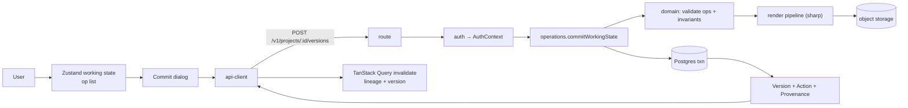

### 32.2 Android → Core

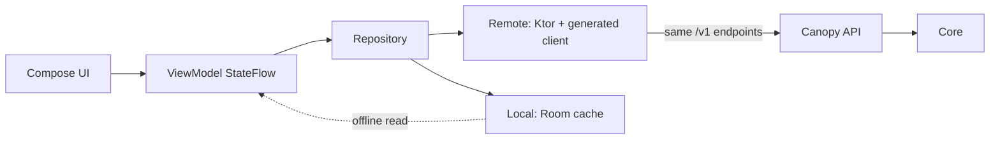

### 32.3 MCP → Core

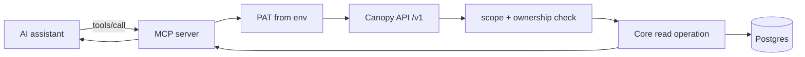

### 32.4 AI generation

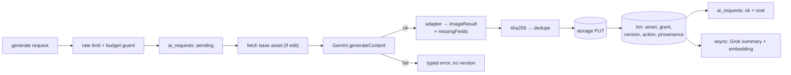

### 32.5 Version creation (all paths converge)

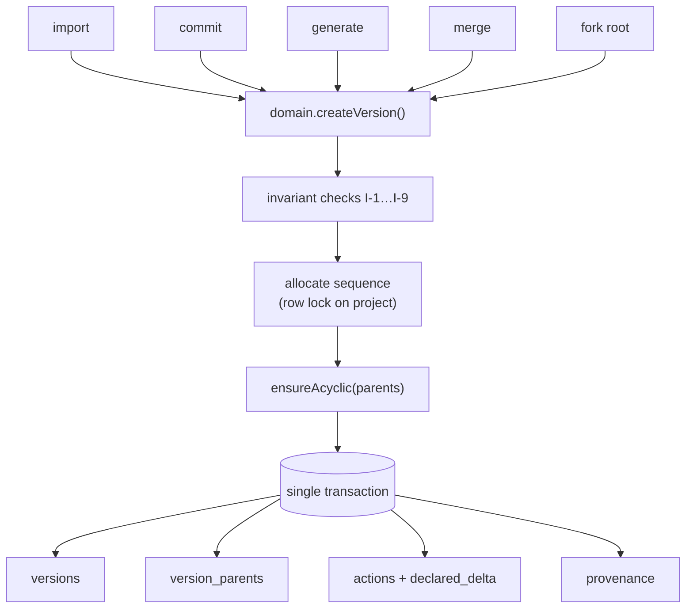

### 32.6 Fork

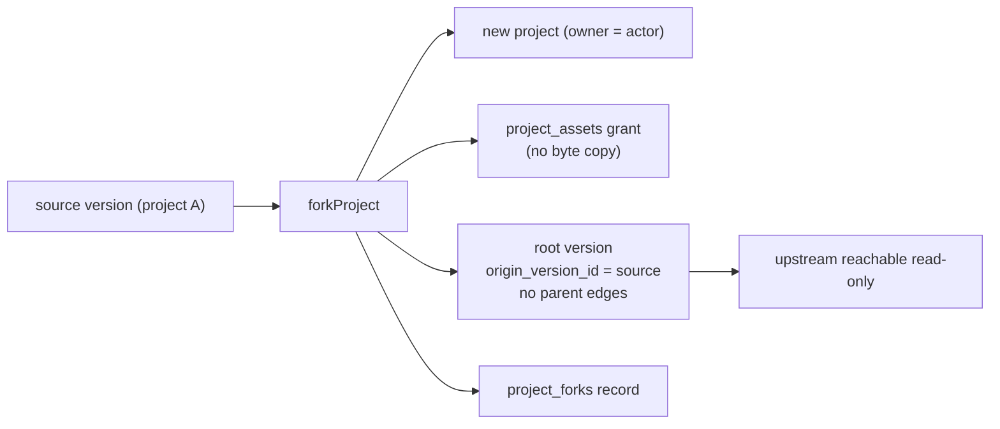

### 32.7 Merge

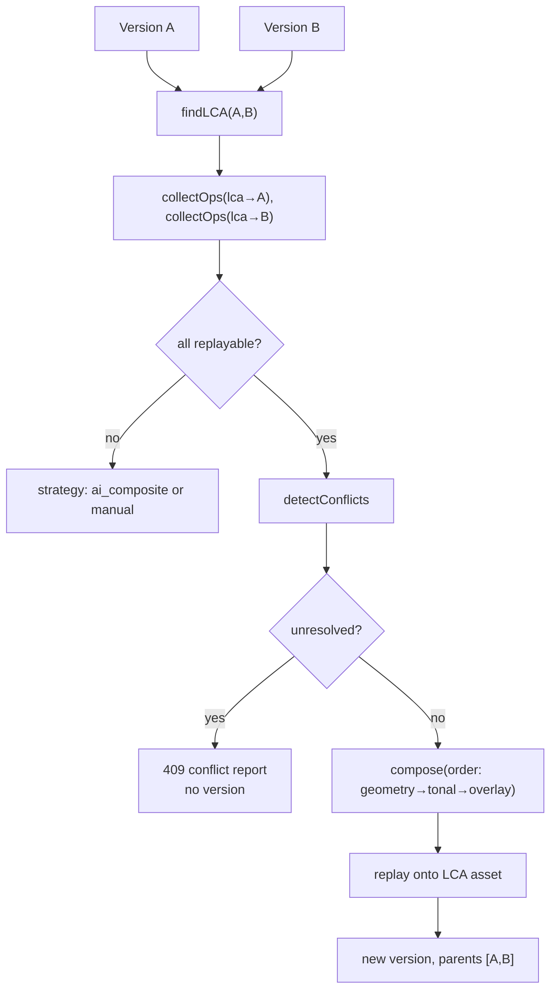

### 32.8 Semantic diff

See §15.2.

### 32.9 Creative Memory

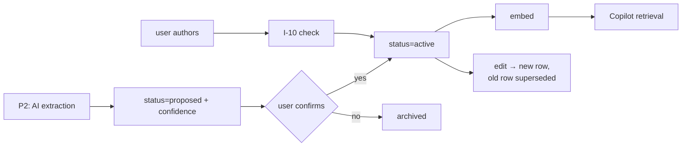

### 32.10 Copilot

See §20.1.

### 32.11 Asset upload and storage

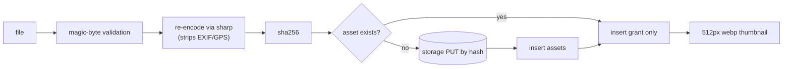

### 32.12 Future integration architecture

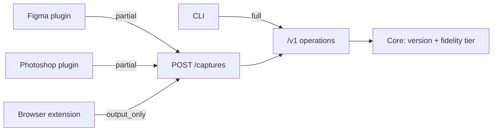

---

## 33. Sequence Diagrams

### 33.1 Human edit → commit

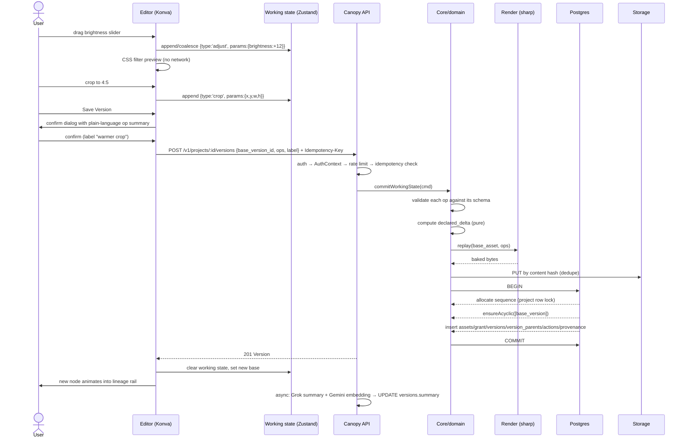

Note the async summary write is the **only** post-hoc write to a version row, and it touches derived columns only (`summary`, `summary_embedding`). This is a deliberate, documented exception to I-1's spirit; it is permitted because those columns are derived, nullable, and never part of history. It is implemented as a narrowly-scoped repository method `setDerivedSummary` that can write nothing else.

### 33.2 AI edit

See §18.3.

### 33.3 Fork

See §12.4.

### 33.4 Merge

```mermaid
sequenceDiagram
  actor U as User
  participant W as Web
  participant API as Canopy API
  participant D as Core
  participant G as Gemini
  U->>W: select V4 and V7 → Merge
  W->>API: POST /v1/merges/analyze {a:V4, b:V7}
  API->>D: findLCA + collectOps + detectConflicts
  D-->>API: {lca:V2, strategies:['operation','manual'], conflicts:[ADJUST_OVERLAP]}
  API-->>W: analysis
  W->>U: three-pane merge view, 1 conflict
  U->>W: resolve: average brightness
  W->>API: POST /v1/merges/preview {..., resolutions}
  API->>D: compose + replay onto LCA asset
  D-->>API: ephemeral preview asset
  API-->>W: preview url
  U->>W: Commit merge
  W->>API: POST /v1/merges {...} + Idempotency-Key
  API->>D: mergeVersions
  D->>D: I-9: ≥2 parents, same project, no ancestor relation
  D-->>API: Version(parents=[V4 primary, V7 merge_source])
  API-->>W: 201
  Note over W: lineage rail draws two inbound edges into the merge node
  alt non-replayable side (P2)
    API->>G: multi-reference composite with derived instruction
    G-->>API: composed image
    Note over API: actor_type=model, determinism=non_deterministic, both sources in provenance
  end
```

### 33.5 Copilot

```mermaid
sequenceDiagram
  actor U as User
  participant W as Web
  participant API as Canopy API
  participant GR as Grok
  participant DB as Postgres
  U->>W: "Why did we change the background?"
  W->>API: POST /v1/projects/:id/copilot/messages (SSE)
  API->>GR: plan(question, tool schemas)
  GR-->>API: tool_calls [search_memory{background}, get_path{V4,V8}]
  API-->>W: event: plan (tool names → "consulting history")
  API->>DB: searchMemory(project, "background")
  DB-->>API: mem_41 (constraint), mem_52 (rejection)
  API->>DB: getPath(V4, V8) + declared deltas
  DB-->>API: V4…V8 with actions
  API->>API: assemble ID-tagged context (12k budget)
  API->>GR: answer(context, citation instruction)
  GR-->>API: streamed tokens
  API-->>W: event: token ×N
  API->>API: validate every cited id exists in context
  API-->>W: event: citations [mem_41, V6, V7]
  API-->>W: event: done
  API->>DB: insert copilot_messages with citations
```

### 33.6 MCP

See §21.1.

---

## 34. Testing Strategy

### 34.1 Priority order

Invariants first. A version model that silently breaks is worse than a missing feature, because every downstream output becomes fiction.

| Tier | Coverage target | When |
|---|---|---|
| **Domain invariant tests** | 100% of I-1…I-11 | Written **with** the domain, Phase 1. Non-negotiable. |
| API contract tests | Every endpoint, happy + auth-denied + validation-failed | Phase 2 onward |
| Integration | Version creation paths, merge, fork, diff pipeline | Phase 6–8 |
| E2E | The demo spine only | Phase 11 |
| AI evaluation | The §20.7 question set + 5 diff pairs | Phase 8 |
| Android | ViewModel state tests only | Phase 10, if built |

### 34.2 Invariant test list (write these first)

| Test | Asserts |
|---|---|
| `version_is_immutable` | No reachable path updates or deletes a version; DB grants confirmed |
| `non_root_has_parent` | Every created version except import and fork-root has ≥1 edge |
| `dag_remains_acyclic` | Merging a version with its own ancestor is refused; merging a version with itself is refused |
| `parents_same_project` | Cross-project parent edges are refused |
| `actor_fields_complete` | Human version without `actor_user_id` refused; model version without provider/model/on_behalf_of refused |
| `provenance_missing_fields_present` | A model version whose provider omitted a seed records `"seed"` in `missing_fields` |
| `sequence_unique_per_project` | Concurrent commits do not collide (test with parallel requests) |
| `fork_root_has_no_parents` | I-8 |
| `fork_copies_nothing` | After fork, source version count unchanged, no new asset rows, one new grant |
| `merge_has_two_parents` | I-9, with ordered roles |
| `merge_replay_matches_asset` | `asset == replay(lca_asset, merged_ops)` byte-for-byte |
| `intelligence_cannot_write` | Intelligence module has no import path to version writers (static check + runtime attempt) |
| `memory_never_active_from_ai` | AI-extracted memory is always `proposed` |
| `repository_requires_auth_context` | Every repo method rejects a missing `AuthContext` |
| `cross_project_read_denied` | User B cannot read user A's project, version, asset URL, memory, diff, or lineage |
| `copilot_citation_validation` | An answer citing an ID absent from context has that claim stripped |
| `mcp_scope_enforced` | A read-scoped PAT is refused on every write tool |

### 34.3 Test infrastructure

Postgres + pgvector and MinIO via `docker-compose`. Each integration test runs in a transaction that is rolled back, except immutability tests, which need committed state and use a per-test schema. AI providers are **mocked by default**; a `--live-ai` flag runs the small evaluation suite against real providers and is run manually, not in CI.

### 34.4 E2E: the demo spine

One Playwright spec walking §41's demo exactly. It runs against seeded data and must pass before the demo freeze. If it fails, the demo is broken — this is the single most valuable test in the repository.

### 34.5 AI evaluation

Deterministic, seeded project. Ground truth committed as fixtures.

| Metric | Target | Method |
|---|---|---|
| Version identification accuracy | ≥95% | Does the answer cite the correct version IDs for the §20.7 set? |
| Citation validity | **100%** | Every cited ID present in assembled context. Mechanical, must not fail. |
| Hallucination rate (uncited specific claims) | ≤5% | Manual rubric over 20 answers |
| Declared-delta correctness | **100%** | Pure function; unit-tested, no model involved |
| Observed-delta facet agreement | ≥70% | Against a human-labelled set of 5 version pairs |
| Diff latency (cached / cold) | <200ms / <8s p50 | Measured |
| Copilot first token | <2s | Measured |

Note that declared-delta correctness is 100% by construction. That is the point of §15 — the number that matters most is the one no model can get wrong.

---

## 35. Observability

### 35.1 Logging

Structured JSON via pino. Every log line carries `request_id`, `user_id`, `project_id` where applicable, `surface`, `duration_ms`.

| Event | Fields |
|---|---|
| `http.request` | method, route, status, duration, request_id |
| `version.created` | version_id, project_id, action_type, actor_type, surface, sequence |
| `merge.completed` / `merge.conflict` | strategy, conflict count, lca_id |
| `fork.created` | source_project, source_version, new_project |
| `ai.request` | provider, model, purpose, latency, tokens, cost, status |
| `ai.failure` | provider, error_code, retryable |
| `diff.computed` | status, evidence_used, confidence, cached |
| `copilot.answered` | tools_used, grounded, citation count, latency |
| `mcp.tool_call` | tool, token_id, project_id, latency, outcome |
| `db.error` | code, constraint, route (never the full query with values) |

### 35.2 Redaction (enforced by the logger, not by discipline)

Never logged: API keys, passwords, password hashes, tokens (only `token_id` and `token_prefix`), refresh cookies, image bytes, full prompts beyond the 200-character preview, user email in analytics events.

### 35.3 MVP dashboards

A single `/internal/health` endpoint (auth-gated) returning: DB connectivity, storage connectivity, last 50 AI requests with status and latency, today's AI cost against the budget, version counts. This is 30 minutes of work and it is what lets the team answer "is the demo about to break?" at hour 23.

Full dashboards, tracing and alerting are FUTURE.

---

## 36. Deployment

### 36.1 Topology

| Component | Platform | Notes |
|---|---|---|
| Web | **Vercel** | Preview deploy per branch |
| API | **Railway** (or Render) | Single container, 2GB RAM minimum — `sharp` needs headroom |
| MCP server | **Railway**, same project, separate service | Small; can also run locally for the demo, which removes a network dependency |
| Postgres + pgvector | **Neon** (or Supabase) | Branching databases are useful for parallel agents |
| Object storage | **Cloudflare R2** (or Supabase Storage) | S3-compatible |
| Secrets | Platform environment variables | Never in the repo |

No Kubernetes, no microservices, no queue, no service mesh. Explicitly rejected per M1 and §40.

### 36.2 Environments

| Env | Purpose |
|---|---|
| `local` | docker-compose: Postgres+pgvector, MinIO. Full stack runnable offline except AI providers. |
| `preview` | Per-PR web deploy against the staging API |
| `demo` | The environment the demo runs on. Frozen at H-2. Seeded. |

There is no separate "production". `demo` is production for this build.

### 36.3 Demo freeze protocol

At **H22**: branch `demo-freeze`, deploy, seed, run the E2E spine, capture a screen recording of a full successful run as the ultimate fallback. After freeze, only bug fixes with a passing E2E run may merge. This rule is worth more than any feature built after hour 22.

### 36.4 Rollback

Platform-level redeploy of the previous build. Migrations are forward-only; if a migration breaks the demo, restore the Neon branch snapshot taken at freeze.

---

## 37. Multi-Agent Development Strategy

### 37.1 Why this section matters

Five AI agents editing one repository will produce merge conflicts and architectural drift unless ownership is explicit. The single highest-risk failure mode is two agents independently inventing the same abstraction in different places.

### 37.2 Agent roster and ownership

| Agent | Owns (exclusive write) | May read | Must never touch |
|---|---|---|---|
| **A1 · Core** (strongest model) | `packages/domain`, `packages/schemas`, `packages/config`, `database/` | everything | `apps/web`, `services/mcp` |
| **A2 · API** | `services/api/src/{routes,operations,repositories,lib}` | domain, schemas | `packages/domain` (proposes changes to A1), `apps/*` |
| **A3 · Web** | `apps/web`, `packages/ui` | schemas, api-client | `services/*`, `packages/domain` |
| **A4 · AI** | `services/api/src/{intelligence,providers}`, `tests/ai-eval` | domain, repositories (read ports) | version writers, `apps/web` |
| **A5 · MCP + Android** | `services/mcp`, `apps/android` | schemas, api-client, openapi.json | `services/api`, `apps/web` |

**Review agent (A0):** a separate session that owns nothing and reviews every PR against §7.4 invariants, §30.2 import matrix, and §44 Definition of Done. A0 has veto. Run A0 with the strongest available model; review quality matters more than generation speed here.

### 37.3 Branch and merge strategy

```
main                    protected, always deployable, E2E must pass
  ├── core/*            A1
  ├── api/*             A2
  ├── web/*             A3
  ├── ai/*              A4
  └── surface/*         A5
```

- Small PRs, one concern each. No PR touching more than one agent's ownership area without A0 approval.
- **Integration windows** at H6, H12, H17, H21: all agents stop, everything merges to `main`, E2E runs, then work resumes. Fixed clock times, announced in advance.
- Conflicts in shared files (`packages/schemas`, `openapi.json`) are resolved by A1, always. No exceptions.
- Commit convention: `type(scope): summary` with types `feat|fix|docs|test|chore|refactor` and scope matching the ownership area.

### 37.4 Contract-first sequencing

The dependency that makes parallelism possible: **A1 ships `packages/schemas` and `packages/domain` signatures by H4.** Everything else is blocked on that and only that. Until H4, A2–A5 work on scaffolding, tooling, design tokens and fixtures against the schemas as they land.

A2 ships **stub endpoints returning fixture data** immediately after schemas land, so A3 and A5 are never blocked on real implementations.

### 37.5 Anti-drift rules

1. No agent invents a new abstraction without adding it to `docs/architecture/`. If it is not in the docs, A0 rejects it.
2. Model IDs, limits and flags come from `packages/config`. A literal model string anywhere else fails review.
3. Domain logic in a route handler fails review.
4. A new Core operation requires updating §6.3's catalogue in `docs/domain/operations.md`.
5. If an agent believes a blueprint decision is wrong, it opens `docs/decisions/PROPOSED-*.md` and continues with the current decision. It does not unilaterally change architecture mid-build.

---

## 38. AI Coding Agent Context Files

These files exist so an agent starting cold does the right thing without reading all 46 sections.

| File | Contents | Length |
|---|---|---|
| **`AGENTS.md`** | Shared rules for every agent: the One Write Path, the invariant list I-1…I-11, the import matrix, forbidden patterns, commit convention, the ownership table, "when in doubt, ask A0". | ≤300 lines |
| **`CLAUDE.md`** | Claude Code entry point: pointer to AGENTS.md, repo map, how to run tests, how to run the stack locally, current phase and which agent this session is. | ≤120 lines |
| **`README.md`** | Human-facing: what Canopy is, how to run it, environment setup. | ≤150 lines |
| `docs/architecture/overview.md` | §4 + §6 condensed, with the layer diagram | |
| `docs/architecture/import-boundaries.md` | §30.2 table, machine-checkable | |
| `docs/domain/model.md` | §7 entities + §7.4 invariants verbatim | |
| `docs/domain/operations.md` | §6.3 catalogue, updated on every new operation | |
| `docs/domain/actions.md` | §10.1 taxonomy with each type's param schema and declared-delta rule | |
| `docs/domain/merge.md` | §13 algorithm, conflict taxonomy, composition order | |
| `docs/api/openapi.json` | Generated, committed, CI-verified | |
| `docs/api/errors.md` | §27.2 error table | |
| `docs/ai/providers.md` | §17–19: capability registry, model constants, failure handling | |
| `docs/ai/copilot.md` | §20: tool set, context format, citation rules | |
| `docs/ai/diff.md` | §15: three sources, output schema, discrepancy rules | |
| `docs/mcp/tools.md` | §21.3 tool schemas |
| `docs/mcp/PROTOCOL.md` | The pinned MCP revision and SDK version, with the verification steps | |
| `docs/android/architecture.md` | §23 | |
| `docs/design/tokens.md` | §31.2 tokens as the source of truth for Tailwind config | |

**Rule:** `AGENTS.md` is loaded into every agent session. If a rule is important enough to matter at 3am at hour 19, it belongs in `AGENTS.md`, not only here.

---

## 39. 24-Hour Execution Plan

Assumes 5 parallel agents plus one human coordinator. Hours are elapsed, not per-agent.

| Phase | Hours | Objective | Output | Validation gate | Fallback if late |
|---|---|---|---|---|---|
| **P0 · Bootstrap** | H0–H1 | Monorepo, pnpm+turbo, docker-compose (PG+pgvector, MinIO), env, CI skeleton, `AGENTS.md`, agent branches | `pnpm dev` runs an empty stack | Stack boots, DB reachable | Drop CI; keep local only |
| **P1 · Core + DB** | H1–H4 | `packages/schemas`, `packages/domain` (entities, invariants, declared-delta, LCA), migrations, seed skeleton | **Contract lands — unblocks everyone** | Invariant tests I-1…I-6 green | **Cannot slip.** Pull A2 onto A1's work. |
| **P2 · API + storage + auth** | H4–H7 | Auth, projects, assets (upload/hash/thumb/signed URL), import, commit, lineage reads. Stub endpoints for later features. | Version creation works via HTTP | Contract tests green; a version is createable by curl | Drop refresh-token rotation; use long access tokens |
| **P3 · Web shell + editor** | H5–H10 | App shell, auth, project list, workspace, Konva canvas, adjust/crop/rotate/flip/text, commit dialog | Human edit → V2 in the browser | Commit round trip <1.5s | Cut text overlay first, then flip |
| **P4 · Lineage UI** | H8–H11 | React Flow graph, dagre layout, actor colouring/shapes, selection, version detail panel, provenance card | The graph is real and legible | 20-node graph renders <300ms | Fall back to a vertical list; keep actor badges |
| **P5 · AI generation** | H10–H13 | Gemini adapter, generate + edit endpoints, `ai_requests` logging, budget guard, error states | AI edit → V3 with full provenance | Provenance shows model + prompt + missing_fields | Generation only, no edit |
| **P6 · Fork + Merge** | H12–H16 | Fork endpoint + UI; merge analyze/preview/commit; conflict taxonomy; three-pane UI | V4 and V7 merge into V8 with 2 parents | `merge_replay_matches_asset` green | Ship `manual` merge only (still 2 parents, still real) |
| **P7 · Semantic diff** | H14–H18 | Declared delta → path summary → observed delta; reconciliation; caching; compare UI with facet cards and confidence | Diff explains V2 vs V8 | Declared-only path works with providers disabled | Ship declared + path only; observed becomes P2 |
| **P8 · Memory + Copilot** | H16–H21 | Memory CRUD + panel; planner with closed tool set; retrieval; context assembly; citation validation; SSE streaming | Copilot answers §20.7 with citations | Citation validity 100% on the eval set | Cut streaming (return whole answers); cut memory search (constraints/goals only) |
| **P9 · MCP** | H20–H22 | MCP server, 5–7 read tools, PAT auth, Inspector verification | An assistant queries the project | Inspector shows tools; one live call succeeds | **Cut entirely.** First thing to go. |
| **P10 · Android** | H20–H23 | 3 read-only screens against the generated client | Phone shows the same lineage | Sign in + lineage + version detail | **Cut entirely.** Architecture doc is the deliverable. |
| **P11 · Integration + polish** | H21–H23 | Empty/loading/error states, seed the demo project, copy pass, keyboard shortcuts | Demo project looks intentional | Full spine by hand, twice | Polish only the 9 demo screens |
| **P12 · Freeze + rehearsal** | H22–H24 | `demo-freeze` branch, deploy, E2E green, record the fallback video, rehearse 3× with a timer | Demo runs in 6 minutes | E2E green; video captured | — |

### 39.1 Critical path

```
P1 (schemas + domain) → P2 (API) → P3/P4 (commit + lineage) → P7 (diff) → P8 (Copilot)
```

Everything else hangs off this. **P1 is the only phase that cannot absorb delay**, because five agents are blocked on it. If P1 is at risk at H3, cut merge from the domain layer for now (add it at H12) and ship schemas early.

### 39.2 Parallel lanes

```
A1 Core   ████████░░░░░░░░ P1, then merge algorithm, then review
A2 API    ░░░░████████░░░░ P2, then merge/diff endpoints, then MCP support
A3 Web    ░░░░░████████░██ P3, P4, merge UI, P11 polish
A4 AI     ░░░░░░░░████████ P5, P7, P8
A5 Surf.  ░░░░░░░░░░░░████ scaffolding early, P9/P10 late (first to be cut)
```

### 39.3 Integration checkpoints

| Time | Gate | If it fails |
|---|---|---|
| **H6** | A version is createable end to end via the API | Stop feature work; all hands on P2 |
| **H12** | Human edit + AI edit visible in the lineage graph in the browser | Cut merge to `manual` only |
| **H17** | Diff renders for two versions, at least declared-only | Cut observed delta permanently |
| **H21** | Copilot answers one question with a correct citation | Ship Copilot with canned retrieval for the 7 demo questions, clearly labelled in the fallback |
| **H22** | **Demo freeze.** No merges without a green E2E run. | — |

---

## 40. Feature Priority Matrix

| Feature | Priority | Rationale |
|---|---|---|
| Auth, projects, asset upload | **P0** | Nothing works without it |
| Import → root version | **P0** | The spine begins here |
| Working state + commit gesture | **P0** | M1 R-11; without it the lineage is noise |
| Typed action records + declared delta | **P0** | Enables diff and merge at zero AI cost |
| Immutable versions + DAG + invariants | **P0** | The product |
| Lineage graph with actor distinction | **P0** | The single most legible screen |
| Adjust / crop / rotate / flip | **P0** | Minimum credible human edit |
| Text overlay | **P0** | Visually unmistakable in a diff |
| Gemini generate + edit with full provenance | **P0** | The model half of the ledger |
| Continue from version (branching) | **P0** | Makes the graph branch |
| Fork (cross-project) | **P0** | Explicit override; §12 |
| Merge — `operation` + `manual` | **P0** | Explicit override; §13. The strongest technical story. |
| Semantic diff — declared + path | **P0** | Works with every provider down |
| Semantic diff — observed | **P0** | Hero capability |
| Creative Memory — user-authored CRUD | **P0** | Explicit override; §14 |
| Copilot — planning, retrieval, citations | **P0** | The understanding half of the thesis |
| Version detail + provenance card | **P0** | Where provenance becomes visible |
| Seeded demo project + fallback data | **P0** | The demo is a deliverable |
| Discrepancy + confidence display | **P1** | Cheap, and it earns credibility |
| Copilot streaming | **P1** | Feels better; not structural |
| MCP read-only server | **P1** | Highest differentiation per hour, but after the spine |
| Memory hybrid search | **P1** | Goals + constraints always-included covers the demo |
| Server-side working-state drafts | **P1** | Nice; client state suffices |
| Export version | **P1** | One endpoint |
| Merge — `ai_composite` | **P2** | Needs multi-reference and careful labelling |
| AI-extracted memory proposals | **P2** | The confirmation UX is the cost, not the extraction |
| Android read-only client | **P2** | First to be cut; never blocks P0/P1 |
| Command palette | **P2** | Lovely; not required |
| Copilot write proposals | **P2** | M1 R-12 pattern, documented not built |
| MCP write tools | **P2** | Machines propose, humans commit |
| Browser extension | **FUTURE** | Host capabilities unconfirmed |
| Figma / Photoshop / Illustrator plugins | **FUTURE** | §24 contract only |
| CLI | **FUTURE** | Token model exists |
| Public developer API | **FUTURE** | `/v1` versioning exists |
| Collaboration, roles, comments, approvals | **FUTURE** | M1 R-15 |
| Video / audio / document media | **FUTURE** | M1 R-16: three cheap provisions only |
| C2PA read / sign | **FUTURE** | M1 R-13: no claims until tested |
| Real-time multiplayer | **FUTURE** | Explicitly out |

---

## 41. Demo Flow

**Target: 6 minutes.** The audience must understand the idea within 60 seconds.

### 41.1 Script

| # | Beat | What the audience sees | Says what |
|---|---|---|---|
| 0 | **The loss** (20s) | A folder: `final_v2_FINAL_client_REAL.png` ×9 | "Nobody can answer why the final looks like this." |
| 1 | Create project + goal (15s) | Empty workspace | Projects have intent, recorded |
| 2 | Import → **V1** (15s) | Root node appears, amber circle | Human actor, full provenance |
| 3 | Human edit → **V2** (30s) | Crop + warmth, commit dialog listing the ops in plain language | The commit gesture; typed operations |
| 4 | AI edit → **V3** (40s) | Gemini removes background; node appears in teal hexagon; provenance card shows model, prompt, and "seed: not reported by provider" | One ledger, two actor kinds. The missing-field line lands harder than a complete card would. |
| 5 | Continue from **V2** → **V4** (25s) | Graph branches visibly | Branching is a shape, not ceremony |
| 6 | Second direction → **V5** with text overlay (25s) | Two live directions | |
| 7 | **Fork** V3 into a new project (20s) | New project, origin chip, zero copying | Cross-project exploration without polluting the original |
| 8 | Back; **Merge** V4 + V5 → **V6** (60s) | Analyze shows LCA V2, one conflict, auto-composed text overlay; resolve; preview; commit; two inbound edges | **"This is not a pixel merge. Canopy stored the operations, so it can actually merge them."** This is the technical high point. |
| 9 | **Compare** V1 ↔ V6 → semantic diff (50s) | Facet cards with record icons vs model icons, confidence meters, one discrepancy shown honestly | Three evidence sources; the system says what it knows and how it knows it |
| 10 | Add a **Memory** (25s) | "Client rejects blue-dominant backgrounds — reads as corporate" | Lineage is what happened; memory is what it meant |
| 11 | **Copilot**: "Why did we change the background?" (50s) | Streaming answer citing V3, V4 and the memory; clicking a citation navigates | Grounded, cited, navigable |
| 12 | **Copilot**: "What did we reject?" (20s) | Memory-grounded answer | |
| 13 | **MCP** (35s, if built) | An assistant in another window calls `canopy_get_lineage` and `canopy_compare_versions` and narrates the project's history | "The same Core, reached by a machine instead of a human." |
| 14 | **Android** (20s, if built) | Phone shows the same lineage and provenance | One platform, three surfaces |
| 15 | Close (15s) | The lineage graph, full screen | "GitHub let software evolve legibly. This is that, for creative work." |

### 41.2 Fallback strategy (§30 of the prompt)

Tiered, all prepared before H22. **Never present fake functionality as real.**

| Tier | Trigger | Behaviour | Disclosure |
|---|---|---|---|
| 0 | Everything works | Live | — |
| 1 | AI generation fails | Seeded project already contains V3 with genuine recorded provenance from a successful earlier run | "Using a pre-generated version; the provenance is real, captured earlier." |
| 2 | Vision provider fails | Diff renders declared + path only, with the degraded banner | The banner **is** the disclosure, and it demonstrates graceful degradation |
| 3 | Copilot provider fails | Switch to cached answers for the 7 demo questions | Say plainly: "These are cached responses from an earlier run; the retrieval and citations are the real ones." |
| 4 | Network or deploy fails | Local stack on the presenter's machine against local Postgres + MinIO | — |
| 5 | Total failure | The H22 screen recording | State clearly that it is a recording |

Merge, fork, lineage, commit, provenance and declared-delta diff all work with **every AI provider down**, because Intelligence is a consumer of Core. That is the architecture earning its keep on stage.

---

## 42. Risk Register

| # | Risk | Prob. | Impact | Mitigation | Fallback | 24h priority |
|---|---|---|---|---|---|---|
| R1 | **P1 (schemas/domain) slips, blocking 5 agents** | Med | Critical | A1 is the strongest model; schemas-first; stub endpoints by H5 | Cut merge from domain until H12; ship schemas alone | **Highest** |
| R2 | Gemini API instability / rate limits / safety blocks | Med | High | Budget guard, one retry, typed errors, no version on failure | Seeded V3 with real captured provenance (Tier 1) | High |
| R3 | Grok API instability | Med | Med | Secondary provider registry entry (Gemini text) | Declared-only diff; cached Copilot answers | High |
| R4 | Editor consumes the schedule | **High** | High | Ops restricted to 5 types; adjustments as CSS filters; server bakes | Cut text overlay, then flip, then resize | High |
| R5 | Merge complexity underestimated | Med | High | `manual` strategy is a normal commit with 2 parents — cheap and always available | Ship `manual` only; it still demonstrates multi-parent lineage | High |
| R6 | Semantic diff accuracy disappoints on stage | Med | Med | Declared delta is deterministic and carries the demo; observed is additive | Declared + path only; discrepancy display turns a weakness into a feature | Med |
| R7 | MCP protocol revision mismatch | **High** | Low | Use the official SDK, pin the revision, verify with Inspector, 20-min budget | Cut P9 entirely | Low |
| R8 | Android over-runs | High | Low | Hard rule: never blocks P0/P1; 3 read-only screens only | Cut P10 entirely; architecture doc is the deliverable | Low |
| R9 | Storage misconfiguration (CORS, signing, region) | Med | High | MinIO locally from H1 so the interface is exercised early | Serve assets through the API as a byte proxy | Med |
| R10 | Postgres/pgvector extension unavailable on the chosen host | Low | High | Verify `CREATE EXTENSION vector` at H1, before anything depends on it | Drop embeddings; structured retrieval alone still answers most §20.7 questions | Med |
| R11 | Auth complexity creep | Med | Med | Password + JWT only; no OAuth, no MFA, no roles | Long-lived access tokens, no rotation | Med |
| R12 | Multi-agent merge conflicts / architectural drift | **High** | High | Exclusive ownership, import-matrix lint, A0 review veto, fixed integration windows | A1 arbitrates all shared-file conflicts | **Highest** |
| R13 | Deployment fails late | Med | High | Deploy a hello-world through the real pipeline at H2, not H22 | Run locally for the demo | High |
| R14 | Provider cost overrun during the build | Med | Med | Per-project budget guard; mock providers in tests by default | Switch to the cheapest model tier via config | Med |
| R15 | Demo machine/network failure | Low | Critical | Local stack ready; recording captured at H22 | Tier 4 / Tier 5 | Med |
| R16 | Scope creep from "while we're here" | **High** | High | §40 matrix is binding; A0 rejects unlisted features | — | High |

---

## 43. ADRs / Technical Decisions

Each: **Decision · Reason · Alternatives · Trade-offs · 24h impact · Future impact.**

| ADR | Decision | Reason | Alternatives rejected | Trade-off | 24h | Future |
|---|---|---|---|---|---|---|
| **001** | Monorepo (pnpm + Turborepo) | One contract, shared schemas, atomic cross-surface changes | Multirepo | Heavier tooling setup | +30 min setup, saves hours of sync | Scales to CLI, extensions |
| **002** | Modular monolith API + separate MCP service | No scaling problem; MCP has different transport, auth and blast radius | Microservices; single service including MCP | One deploy boundary to police | Fastest path | Split by module later if needed |
| **003** | PostgreSQL as sole source of truth | M1 principle 3 | Mongo, multiple stores | Relational modelling of a DAG | None | Correct at any scale here |
| **004** | pgvector in the same DB | Current guidance: start with pgvector HNSW, move only after measuring a limit. Canopy is far below it. | Pinecone, Qdrant, Milvus | Fewer vector-specific features | Saves ~2h | pgvectorscale if ever needed |
| **005** | Content-addressed global assets + `project_assets` grants | Makes fork O(1) and dedupes across projects | Per-project asset rows | Deletion needs refcounting (deferred) | Enables override 1 | Enables sharing, templates |
| **006** | Ordered multi-parent edge table | Merge needs it; M1 R-05 foresaw it | `parent_id` column | One join | +20 min | No migration when compositing/video arrive |
| **007** | Typed, parameterised actions | Enables free declared-delta diff **and** deterministic merge | Storing only result images | Restricts the editor's expressiveness | Saves hours downstream | The platform's core asset |
| **008** | Server bakes pixels at commit | Guarantees `asset == replay(base, ops)`, which merge depends on | Client-side rendering | Font bundle restriction; server CPU | Slightly slower commit | Enables any-surface commit |
| **009** | Next.js + TanStack Query + Zustand | Speed, agent familiarity, right split of server/client state | Remix, Vite SPA, Redux | Next.js weight | Fastest | Fine |
| **010** | Konva + react-konva for the editor | Scene graph with official React bindings; multi-layer rendering | Fabric.js (stronger built-in image editing but weaker React story); raw canvas; PixiJS (GPU, aimed at games) | Fewer built-in image filters; adjustments done as filters anyway | Neutral | Revisit if masks/brushes arrive |
| **011** | React Flow + dagre for lineage | Nodes, edges, pan/zoom, custom nodes, selection out of the box | D3 by hand; Cytoscape | Less layout control | Saves ~3h | Custom renderer if graphs get huge |
| **012** | Kotlin + Jetpack Compose for Android | Native camera/image handling for the capture-first future; not a WebView | React Native, Flutter, WebView | No language sharing with the API | P2 only | Correct long-term |
| **013** | Gemini for image generation, editing and vision | Native editing + multi-reference input, which `ai_composite` merge needs; documented model tiers | Single-purpose generation APIs | Vendor concentration | Fast | Registry makes swapping cheap |
| **014** | Grok for reasoning, planning, summarisation | OpenAI-compatible API, documented function calling and structured outputs, image input as a vision fallback | Using Gemini for everything | Two vendors to monitor | Low cost | Provider diversity is a resilience win |
| **015** | Capability registry, not a fallback framework | M1 R-09: one provider behind a contract; registry is config | Full adapter framework now | Less flexible day one | Saves ~2h | Third provider is config |
| **016** | MCP via official SDK, pinned revision, read-only | The 2026 stateless revision is large; SDKs lag; writes need a confirmation UX | Hand-rolled server; write tools now | Fewer capabilities | Bounded | Writes when the proposal UX exists |
| **017** | Memory as a subsystem, distinct from lineage | Fact vs interpretation; I-10 forbids restating lineage | M1's summary-field-only cut | One more table and retrieval path | +2h | Grows into project intelligence |
| **018** | Merge as operation-set merge, not pixel merge | Typed actions make it tractable and honest | Git-style 3-way; always-AI merge | Only works when both sides are replayable | +3h | AI composite extends it |
| **019** | Three-source semantic diff | Determinism first; degrades to zero-AI | Vision-only comparison | More pipeline code | +1h | Region localisation later |
| **020** | Email+password + JWT + rotating refresh; PATs for machines | Removes a third-party dependency from the demo critical path | OAuth-only, magic links | Password handling | Predictable | OAuth/MFA later |
| **021** | Authorization enforced at the repository layer | MCP, CLI and extensions bypass the UI; agents drop middleware checks during refactors | Route middleware | Every repo method needs AuthContext | +45 min | The right boundary permanently |
| **022** | Vercel + Railway + Neon + R2 | Simple managed services, minutes to deploy | Kubernetes, self-hosting, serverless functions | Vendor lock-in at trivial scale | Fastest | Portable; all S3/Postgres-compatible |

---

## 44. Definition of Done

A feature is done when **all** of the following hold. Placeholder screens are not done. "It worked once" is not done.

| # | Criterion |
|---|---|
| 1 | **Implemented** behind a Core operation, reachable only through the One Write Path |
| 2 | **API contract** present in `packages/schemas` and reflected in the committed `openapi.json` |
| 3 | **Validated** — request schema enforced server-side; client validation is a convenience, never the enforcement |
| 4 | **Authorized** — repository-layer ownership predicate applied; a cross-user test proves denial |
| 5 | **Error-handled** — every failure returns a typed code from §27.2; no unhandled rejection reaches the client |
| 6 | **UI states** — loading, empty and error implemented, not just the happy path |
| 7 | **Invariants tested** where the feature touches I-1…I-11 |
| 8 | **Integrated** — works from the Web client end to end, not only via curl |
| 9 | **Observable** — emits the structured log event from §35.1 |
| 10 | **Documented** — the relevant `docs/` file updated so another agent can extend it without re-deriving the design |
| 11 | **Degrades** — if it depends on a provider, the provider-down path is implemented and user-visible |
| 12 | **Reviewed** by A0 against the import matrix and this checklist |

Feature-specific additions:

| Feature | Additional DoD |
|---|---|
| Commit | Working state cleared; new node animates in; idempotency key honoured on retry |
| Generate | Provenance card shows model, prompt and `missing_fields`; failure creates no version and no orphan asset |
| Fork | Zero asset bytes copied (asserted by a test counting `assets` rows) |
| Merge | `merge_replay_matches_asset` passes; conflict report renders; 409 leaves no partial state |
| Diff | Works with both AI providers disabled (`declared_only`) |
| Copilot | 100% citation validity on the eval set; ungrounded answers visibly marked |
| Memory | AI-extracted memories are `proposed`, never `active`; edit creates a successor |
| MCP | Inspector verification recorded in `docs/mcp/PROTOCOL.md`; read-scoped token refused on writes |

---

## 45. Future Roadmap

| Phase | Contents | Gate to enter |
|---|---|---|
| **Now (24h)** | Web + Core + versioning + lineage + fork + merge + diff + memory + Copilot; MCP and Android if time | — |
| **Phase 2** | Android read/write with camera capture and offline commit queue; MCP write tools with a confirmation UX; Copilot proposals (M1 R-12); memory extraction; project search | Core stable; real users |
| **Phase 3** | Browser extension (`output_only`), Figma and Photoshop plugins (`partial`), CLI; the capture contract in §24.1 goes live | Extension auth + fidelity UI proven |
| **Phase 4** | Collaboration: sharing, reviewers, comments, approvals, roles; team workspaces; advanced provenance including inbound C2PA reading | Multi-user authorization model replaces single-owner |
| **Phase 5** | Video and audio via the same Core: timeline structures as action parameters; region-level visual diff localisation; C2PA signing as a conforming producer; public developer API and third-party ecosystem | Scale and demand |

Roadmap discipline: **no phase begins until the previous phase's features meet §44**. The failure mode for this product is breadth at the expense of a trustworthy ledger.

---

## 46. Final Implementation Checklist

### Before writing any code
- [ ] Every agent has read `AGENTS.md` and knows its ownership area (§37.2)
- [ ] `docker-compose` runs Postgres+pgvector and MinIO locally
- [ ] `CREATE EXTENSION vector` verified on the chosen host (R10)
- [ ] Gemini and Grok API keys obtained and a hello-world call made from a scratch script (not committed)
- [ ] **Model IDs re-verified against live provider docs** — §18.1 and §19.1 are research notes, not guarantees
- [ ] A hello-world deploy pushed through the real Vercel/Railway pipeline (R13)
- [ ] `.env.example` complete; `gitleaks` in CI

### Core correctness (non-negotiable)
- [ ] I-1…I-11 implemented and tested
- [ ] DB grants revoke UPDATE/DELETE on version tables
- [ ] Every repository method takes an `AuthContext`
- [ ] Cross-user access denied for project, version, asset URL, memory, diff, lineage
- [ ] `merge_replay_matches_asset` green
- [ ] `fork_copies_nothing` green
- [ ] Intelligence has no import path to version writers

### Feature completeness
- [ ] Import → commit → generate → continue-from → fork → merge all create versions through the same Core path
- [ ] Declared delta computed for every action type, with no model involved
- [ ] Diff works with both providers disabled
- [ ] Copilot citation validation rejects fabricated IDs
- [ ] Memory I-10 check implemented
- [ ] Provenance renders `missing_fields` as explicit text, never blank

### Demo readiness
- [ ] Seed project committed and deterministic
- [ ] Fallback tiers 1–5 prepared (§41.2)
- [ ] E2E spine green
- [ ] `demo-freeze` branch cut at H22 and deployed
- [ ] Screen recording captured
- [ ] Rehearsed three times with a timer; under 6 minutes
- [ ] Every fallback has honest disclosure copy written in advance

### Documentation handoff
- [ ] `docs/` files in §38 exist and match the implementation
- [ ] `openapi.json` committed and CI-verified
- [ ] `docs/mcp/PROTOCOL.md` records the pinned revision
- [ ] Any deviation from this blueprint recorded in `docs/decisions/`

---

## Appendix A — Research provenance

Technology claims in §18, §19, §21.2 and §25 were verified by web research in September 2026 and are labelled as research, not guarantees. Model identifiers, pricing and protocol revisions change quickly; **re-verify before the first call.**

| Claim | Source |
|---|---|
| Gemini image model family, tiers, native editing, multi-reference input, SynthID watermark | Google Gemini API image generation documentation (`ai.google.dev`), Firebase AI Logic model tables |
| xAI API is OpenAI-compatible at `api.x.ai/v1`; Grok 4.6 flagship with reasoning, function calling, structured outputs, image input | xAI API site and model documentation; OpenRouter model pages |
| MCP 2026-07-28 revision: stateless core, `_meta` per-request capability declaration, `server/discover`, deprecations | modelcontextprotocol.io specification and architecture pages |
| pgvector: HNSW as the default for small-to-medium workloads; hybrid vector + full-text is the current production pattern; move beyond only after measuring | pgvector best-practice guidance (managed Postgres vendor documentation) |
| Canvas library trade-offs: Konva's scene graph and official React bindings vs Fabric's image-editing feature depth | Konva project documentation |
| C2PA: conformance programme, hardware signing, metadata stripping by intermediaries, 2026 regulatory deadlines | Content Authenticity Initiative; IPTC Metawatch measurements |

---

## Appendix B — Terminology quick card for agents

```
Working State   mutable draft        → never in lineage
Commit          explicit gesture     → creates a Version
Version         immutable node       → never updated or deleted
Action          typed + parameterised → enables diff and merge
Actor           human | model        → both in one ledger
Continue from   new version, same project, earlier parent
Fork            new project, origin in another project, copies nothing
Merge           ≥2 parents, operation-set composition, new immutable version
Lineage         what happened        (fact)
Memory          what it meant        (interpretation)
Declared delta  from the record      (free, deterministic, always available)
Observed delta  from a vision model  (additive, confidence-scored, optional)
Capture fidelity full | partial | output_only — never upgraded after the fact
```

**End of blueprint.**
